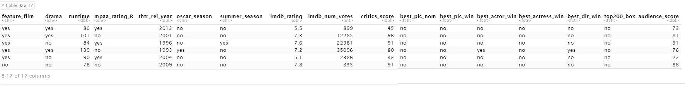

# Bayesian Linear Regression to Predict the Audience Scores for IMDB Movies

In this article, we are going to use the `R` package `BAS` and leverage the Bayesian Linear Regression implementation to predict the audience score for an IMDB movie given other predictor variables. This appeared as a Data Analysis Project in the *Coursera* course *Bayesian Statistics* by  *Duke University*.

The dataset (naely, `movies.Rdata`) we shall use contains information about how much audiences and critics like movies as well as numerous other variables about the movies. This dataset is shown in the next section, and it includes information from Rotten Tomatoes and IMDB for a random sample of movies.

We are interested in learning what attributes make a movie popular and also in learning something new about movies. 

As part of this project we shall complete exploratory data analysis (EDA), modeling, and prediction.

We shall develop a Bayesian regression model to predict `audience_score` from the following explanatory variables. Note that some of these variables are in the original dataset provided, and others are new variables we shall need to construct in the data manipulation section using the `mutate()` function in `dplyr`:

* feature_film: "yes" if title_type is Feature Film, "no" otherwise
* drama: "yes" if genre is Drama, "no" otherwise
* runtime
* mpaa_rating_R: "yes" if mpaa_rating is R, "no" otherwise
* thtr_rel_year
* oscar_season: "yes" if movie is released in November, October, or December (based on thtr_rel_month), "no" otherwise
* summer_season: "yes" if movie is released in May, June, July, or August (based on thtr_rel_month), "no" otherwise
* imdb_rating
* imdb_num_votes
* critics_score
* best_pic_nom
* best_pic_win
* best_actor_win
* best_actress_win
* best_dir_win
* top200_box

All analysis are done using the `R` programming language via RStudio, and this writeup is prepared as an R Markdown document.

The project consists of 6 parts:

1. Data
2. Data manipulation
3. EDA
4. Modeling
5. Prediction
6. Conclusion

## Setup

### Load packages

```{r load-packages, message = FALSE, warning=FALSE}
library(ggplot2)
library(dplyr)
library(statsr)
library(BAS)
```

### Load data

Let's make it sure that the data and R Markdown files are in the same directory. When loaded the data file will be called `movies`. Let's load the data first

```{r load-data}
load("movies.Rdata")
```

## Part 1: Data

To start with, let's describe how the observations in the sample are collected, and the implications of this data collection method on the scope of inference (generalizability / causality).

The data set is comprised of $651$ randomly sampled movies (produced and released before $2016$). Also, from the below summary of the data, it can be seen the dataset is quite representative (diverse in the sense that it contains many possible combination of values for each of the explanatory variables) of the population, hence likely to be *generalizable* (assuming that the relation between predictor and response does not change much after $2016$). 

But, there is no controlled experiment / random assignment done and the covariates of the linear regression are not chosen with a controlled experiment, hence it is likely to imply correlation between response and the predictors and *not causality*.

Also, since the underlying movies dataset from which the samples were chosen is likely not randomly sampled from the entire population of movies, there can be selection bias (e.g., voluntary bias).

```{r data, message = FALSE, warning=FALSE}
library(GGally)
#head(movies)
names(movies)
summary(movies[,c(2:5, 7:8, 10:23)])
```

<div id="bg">
  
</div>  

From the above summary, we can see that out of $651$ movies only $22$ got best picture nominations for the oscar, the mean IMDB rating in the sample dataset is around $6.5$, the average critics score is around $57.7$, whereas the average audience score is around $62.4$.

```{r fig.width=20, fig.height=20}
p <- ggpairs(na.omit(movies), columns=c("title_type", "genre", "runtime", "mpaa_rating", "thtr_rel_year", 
                                        "thtr_rel_month", "imdb_rating", "imdb_num_votes", "critics_score", 
                                        "audience_score", "best_pic_win", "top200_box"), 
             title="correlogram", 
             progress = FALSE) 
suppressMessages(print(p))
```

The above figure visualizes the distribution of the variables and the mutual association between any two pairs chosen. For example, observe that `runtime` is right skewed, whereas `imdb_rating` and `audiance_score` variables are left skewed. The variables `imdb_rating` and the `critics_score` have positive correlations with the response variable `audience_score` etc.    

## Part 2: Data manipulation

Let's create the following new variables using the `mutate()` function in the `dplyr` package:

* Create new variable based on `title_type`: New variable should be called `feature_film` with levels yes (movies that are feature films) and no 

* Create new variable based on `genre`: New variable should be called `drama` with levels yes (movies that are dramas) and no

* Create new variable based on `mpaa_rating`: New variable should be called `mpaa_rating_R` with levels yes (movies that are R rated) and no

* Create two new variables based on `thtr_rel_month`: 

    * New variable called `oscar_season` with levels yes (if movie is released in November, October, or December) and no

    * New variable called `summer_season` with levels yes (if movie is released in May, June, July, or August) and no

Let's use the following `R` code to create the new variables.    

```{r}
movies <- movies %>% mutate(feature_film = ifelse(title_type == 'Feature Film', 'yes', 'no'),
                            drama = ifelse(genre == 'Drama', 'yes', 'no'),
                            mpaa_rating_R = ifelse(mpaa_rating == 'R', 'yes', 'no'),
                            oscar_season = ifelse(thtr_rel_month >= 10, 'yes', 'no'),
                            summer_season = ifelse(thtr_rel_month %in% 5:8, 'yes', 'no'))
names(movies)
head(movies[c('feature_film', 'drama', 'mpaa_rating_R', 'oscar_season', 'summer_season')])
```
As can be seen from above, the new variables are added to the tibble, as needed.

## Part 3: Exploratory data analysis

Let's perform exploratory data analysis (EDA) of the relationship between `audience_score` and the new variables constructed in the previous part. The EDA contains numerical summaries and visualizations. Each R output and plot is accompanied by a brief interpretation.

The following code snippet analyzes the relationship between the `audience_score` and `feature_film`, with exploratory visualization.

```{r}
ggplot(movies, aes(audience_score, group=feature_film, fill=feature_film)) + 
  geom_boxplot() + ggtitle('boxplot of audiance score grouped by feauture_film')
ggplot(movies, aes(audience_score, group=feature_film, fill=feature_film)) + 
  geom_density(alpha=0.5) + ggtitle('distribution of audiance score grouped by feauture_film')
movies %>% group_by(feature_film) %>% 
  summarize(score_Min = min(audience_score),
             score_Q1 = quantile(audience_score, .25),
             score_mean = mean(audience_score), 
             score_median = median(audience_score), 
             score_Q3 = quantile(audience_score, .75),
             score_Max = max(audience_score))
```
As can be seen from the above plots and the summary statistics table, the distribution of audiance scores of feature films is more uniform than the ones for the non-feature films, for which the distribution is right skewed. On average the non-feature films obtain much higher audiance scores (~81) than the feature films (~60.5). Hence, this is likely to be a discriminating predictor variable for the response variable audiance_score.

Similarly, the following code snippet analyzes the relationship between the `audience_score` and `drama`, with exploratory visualization.

```{r}
ggplot(movies, aes(audience_score, group=drama, fill=drama)) + 
  geom_boxplot() + ggtitle('boxplot of audiance score grouped by drama')
ggplot(movies, aes(audience_score, group=drama, fill=drama)) + 
  geom_density(alpha=0.5) + ggtitle('distribution of audiance score grouped by drama')
movies %>% group_by(drama) %>% 
  summarize(score_Min = min(audience_score),
             score_Q1 = quantile(audience_score, .25),
             score_mean = mean(audience_score), 
             score_median = median(audience_score), 
             score_Q3 = quantile(audience_score, .75),
             score_Max = max(audience_score))
```
Again, as can be seen from the above plots and the summary statistics table, the distribution of audiance scores for movies of genre Drama is more right-skewed than the ones for the non-dramas, for which the distribution is more uniform. On average the movies of genre dramas obtain  higher audiance scores (~$65$) than the non-dramas (~$60$).

Next, the following code snippet analyzes the relationship between the `audience_score` and `mpaa_rating_R`, with exploratory visualization.

```{r}
ggplot(movies, aes(audience_score, group=mpaa_rating_R, fill=mpaa_rating_R)) + 
  geom_boxplot() + ggtitle('boxplot of audiance score grouped by mpaa_rating_R')
ggplot(movies, aes(audience_score, group=mpaa_rating_R, fill=mpaa_rating_R)) + 
  geom_density(alpha=0.5) +  ggtitle('distribution of audiance score grouped by mpaa_rating_R')
movies %>% group_by(mpaa_rating_R) %>% 
  summarize(score_Min = min(audience_score),
             score_Q1 = quantile(audience_score, .25),
             score_mean = mean(audience_score), 
             score_median = median(audience_score), 
             score_Q3 = quantile(audience_score, .75),
             score_Max = max(audience_score))
```
Finally, as can be seen from the above plots and the summary statistics table, the distribution of audiance scores for movies with mpaa rating R is almost similar to the ones with non-R ratings. On average the movies with rating R obtain slightly lower audiance scores (~$64$) than the those with non-R ratings (~$65.5$). Hence, this predictor variable alone is less likely to be a discriminator for the response variable audiance score.


## Part 4: Modeling

Let's develop a Bayesian regression model (with **Bayesian Model averaging**) to predict `audience_score` from the following explanatory variables. Note that some of these variables are in the original dataset provided, and others are new variables we constructed earlier:`feature_film`,` drama`, `runtime`, `mpaa_rating_R`, `thtr_rel_year`, `oscar_season`, `summer_season`, `imdb_rating`, `imdb_num_votes`, `critics_score`, `best_pic_nom`, `best_pic_win`, `best_actor_win`, `best_actress_win`, `best_dir_win`, `top200_box`. Let's perform *Bayesian model selection* and report the final model. Also, we shall perform model diagnostics and interpret coefficients of the final model in context of the data.

Let's first create a reduced dataset with the relevant feature variables as mentioned and then clean the data by removing `NA` values. Then let;s create a Bayesian linear regression model, with `BIC` prior on the coefficients and a `uniform` model prior (equal probabilities to all models), 
using the following `R` code snippet.

```{r}
movies_reduced <- movies[c('feature_film', 'drama', 'runtime', 'mpaa_rating_R', 'thtr_rel_year', 
                           'oscar_season', 'summer_season', 'imdb_rating', 'imdb_num_votes', 
                           'critics_score', 'best_pic_nom', 'best_pic_win', 'best_actor_win', 
                           'best_actress_win', 'best_dir_win', 'top200_box', 'audience_score')]
#head(movies_reduced)
```

<div id="bg">
  
</div>  

```{r}
dim(movies_reduced)
movies_no_na <- na.omit(movies_reduced)
dim(movies_no_na)
# Fit the model using Bayesian linear regression, `bas.lm` function in the `BAS` package
bma_lscore <- bas.lm(audience_score ~ .-audience_score, data = movies_no_na,
                   prior = "BIC", 
                   modelprior = uniform())

# Print out the marginal posterior inclusion probabilities for each variable                
bma_lscore
```

```{r}
summary(bma_lscore)
```

Printing the model object and the summary function gives us both the posterior model inclusion probability for each variable and the 5 most probable models. For example, the posterior probability that `runtime` is included in the model is $0.46971$, as can be seen from above output. Further, the most likely model, which has the highest posterior probability of $0.1297$, includes an `intercept`, `runtime`, `imdb_rating` and `critics_score` (shown in the figure with title *Model Ranking*, where the most likely model, i.e., model 1 corresponds to the leftmost model), with $R^2$ of $0.7549$. Also the above table shows the *Bayes factor*s for each model to the highest probability model (hence its Bayes factor is $1$). To see beyond the first five models, we can represent the collection of the models via an image plot. By default this shows the top $20$ models (`?image.bas`). 

```{r fig1, fig.height = 8, fig.width = 8}
image(bma_lscore, rotate = F)
```

This above image has rows that correspond to each of the variables and intercept, with labels for the variables on the y-axis. The x-axis corresponds to the possible models. These are sorted by their posterior probability from best at the left to worst at the right with the rank on the top x-axis. Models that are the same color have similar log Bayes factors which allows us to view models that are clustered together that have Bayes Factors where the differences are not *worth a bare mention*. This plot indicates that the `imdb_rating` and the `critics_score` enter the almost all the models together, and is an indication of the high correlation between the two variables. But the `best_actor_win_yes` and `best_actress_win_yes` have low correlation, as can be verified using the code snippet below.

```{r}
cor(movies_no_na$imdb_rating, movies_no_na$critics_score)
cor(movies_no_na$best_actor_win == 'yes', movies_no_na$best_actress_win == 'yes')
```

While a posterior probability of $0.1297$ for model 1 (the one with the highest posteriror probability) sounds small, it is much larger than the uniform prior probability assigned to it, since there are $2^{16}$ possible models. The following figure shows how the posterior probabilities for the top $25$ models got increased from the uniform prior probabilities.

```{r}
k <- 25
indices <- sort(bma_lscore$postprobs, decreasing = TRUE, index.return=TRUE)$ix[1:k]
ggplot() + 
  geom_line(aes(1:k, bma_lscore$priorprobs[indices]/2^16, color='prior probs of models'), stat='identity', lwd=2) +
  geom_line(aes(1:k, bma_lscore$postprobs[indices], color='posterior probs of models'), stat='identity', lwd=2) + 
  xlab(sprintf('top %d models with the highest posterior probs', k)) + ylab('probabilities')
```

#### Interpreting the coefficients

It is also possible to visualize the posterior distribution of the coefficients under the model averaging approach. Plots of the posterior distributions averaging over all of the models can be obtained using the plot method for the `bas` coefficient object. Let's graph the posterior distribution of the coefficients of `runtime` and `imdb_rating` below. Note that the subset parameter dictates which variable is plotted. 

```{r}
# Obtain the coefficients from the model `bma_lscore`
coef_lscore <- coefficients(bma_lscore)
coef_lscore

# `runtime` is the 4th variable, while `imdb_rating` is the 9th variable in the data set
plot(coef_lscore, subset = c(4,9), ask = FALSE)
```
As can be seen from the above figure, the vertical bar in each of the posterior distributions plotted represents the posterior probability that the corresponding coefficient is $0$ while the bell shaped curve represents the density of plausible values from all the models where the coefficient is non-zero. Since `imdb_rating` is always included (with posterior model inclusion probability 1), there is no vertical bar in the distribution corresponding to `imdb_rating`, whereas `runtime` may not be included with a probability around $0.5$.

We can also provide $95\%$ credible intervals for these coefficients, as done with the below code snippet.

```{r}
confint(coef_lscore)
```
The first two columns represent the $95\%$ credible interval for the parameters. For example, it means that, after seeing the dataset, we may believe that with $95\%$ probability the coefficient for the predictor variable `imdb_rating` will be inside the interval $[13.60825, 16.48687]$, with posterior mean $14.98203$. The other coefficients can be interpreted in the same way. The third column (beta) in the above table is the posterior mean. This uses Monte Carlo sampling to draw from the mixture model over coefficient where models are sampled based on their posterior probabilities.


```{r}
plot(confint(coef_lscore, parm = 2:16))
```

using the `parm` argument to select which coefficients to plot (the intercept is parm=1).

For estimation under selection, `BAS` supports additional arguments via estimator. The default is `estimator="BMA"` which uses all models or `n.models`. Other options include estimation under the highest probability model (*HPM*) or median probability model (*MPM*).

#### Diagnostics
Now, let's try *Zellner-Siow Cauchy* (`ZS-null` prior) on the coefficients and use Markov Chain Monte Carlo (`MCMC`) to compute posterior inclusion  probabilities.

```{r}
bas_zs =  bas.lm(audience_score ~ ., 
                   data=movies_no_na,
                   initprobs = "eplogp",
                   prior="ZS-null",
                   modelprior=uniform(),
                  method = "MCMC")

summary(bas_zs)

diagnostics(bas_zs, type="pip", col = "blue", pch = 19, cex = 2)
```
* Convergence: Let's check whether the MCMC (performed for this model selection) ran long enough and converged. Diagnostics function is used to ensure that most points stay in the $45^o$ diagonal line. The above convergence plot shows that all points fall within the $45^o$ diagonal line, suggesting that the posterior inclusion probability (pip) for each variable from *MCMC* has converged to the theoretical posterior inclusion probability.

```{r}
diagnostics(bas_zs, type = "model", col = "blue", pch = 19, cex = 2)
```
From the above figure, We can see that all of the points lie on the $45^o$ line, validating the convergence of the posterior probabilities for the models given the filtration of all the observed data.

* Residuals vs. Fitted Values: The Residuals plot does not display a random scatter around 0, with non-constant variance across the data. 

```{r}
plot(bas_zs, which = 1)
```

As seen from the figure above, for most of the fitted values, the residuals are centered around $0$, and the model appears to show a decrease in residual variance at its higher predicted values. This suggests that the model is likely to perform better prediction at higher audience scores. However, for fitted values that are less than $40$, the model tends to underestimate the `audience `score`s of the movies with high variance. The figure also shows $3$ possible outliers detected in this region.

* Model Probabilities: As can be seen from the next figure, the model probabilities starts to level off after $2000$ trials with `MCMC`, as each additional model does not contribute to an increase in cumulative probability. The search stops at $6000$, instead of enumerations of $2^16$ possible models, as done earlier with `BIC` prior on the coefficients.

```{r}
  plot(bas_zs, which = 2)
```
* Model Complexity: The next figure shows that the models with highest *Bayes Factors* / *marginal likelihood* have around $3$ or $4$ predictors.

```{r}
plot(bas_zs, which = 3)
```
* Marginal Inclusion Probabilities: The lines in red correspond to the variables where the posterior inclusion probability (pip) is greater than $0.5$, suggesting that these variables (e.g., `imdb_rating`, `critics_score`) are important predictors for the response audience score.

```{r}
plot(bas_zs, which = 4, ask=F)
```

## Part 5: Prediction

Now let's pick a movie from 2016 (a new movie that is not in the sample) and do a prediction for this movie using the model we  
developed and the `predict()` function in `R`.

The new movie (not yet observed / not present in the training sample) that we shall use for prediction is *Moonlight (2016)* (note that the ground-truth audience score for this movie is $79$). Let's first create the data which we shall use for prediction using th following code snippet. The below links are the references for where the data for this movie comes from:

1. https://www.imdb.com/search/title/?year=2016,2016&sort=num_votes,desc
2. https://www.rottentomatoes.com/m/moonlight_2016
3. https://editorial.rottentomatoes.com/article/chicago-film-critics-2016-winners-announced/
4. https://en.wikipedia.org/wiki/Moonlight_(2016_film)
5. https://www.boxofficemojo.com/release/rl2558428673/rankings/?ref_=bo_rl_tab#tabs

```{r}
moonlight <- data.frame(feature_film='yes', drama='yes', runtime=111, mpaa_rating_R='yes', 
                        thtr_rel_year=2016, oscar_season='yes', summer_season='no', 
                        imdb_rating=7.4, imdb_num_votes=305195, critics_score=98, 
                        best_pic_nom='yes', best_pic_win='yes', best_actor_win='yes', 
                        best_actress_win='no', best_dir_win='no', top200_box='yes', 
                        audience_score=79)
newdata <- moonlight[-length(moonlight)]
newdata
#movies_no_na[movies_no_na$best_pic_win=='yes', c('best_pic_win','best_pic_nom')]
#names(movies_no_na)
```

Now, we shall aim to predict the audience score for this new movie using the model fitted above. Simulation is used in `BAS` to construct predictive intervals with **Bayesian Model averaging**, while exact inference is often possible with predictive intervals under model selection. `BAS` has methods defined to return fitted values, fitted, using the observed design matrix and predictions at either the observed data or potentially new values, predict, as with `lm`.

Let's use the `predict()` function to obtain the prediction for the audience score for the new movie first under model averaging and then compute a $95\%$ prediction interval for the audience score with covariates at the levels of the individual specified by opt, using the following code snippet.

```{r}
BMA_pred_bma_lscore <- predict(bma_lscore, newdata=newdata, estimator = "BMA", se.fit = TRUE)
ci_BMA_lscore <- confint(BMA_pred_bma_lscore, estimator = "BMA")
opt_BMA <- which.max(BMA_pred_bma_lscore$fit)
ci_BMA_lscore[opt_BMA, ]
```
Let’s find predicted values under the best predictive model, the one that has predictions closest to *BMA* and corresponding posterior standard deviations.

```{r}
BPM_pred_bma_lscore =  predict(bma_lscore, newdata=newdata, estimator="BPM", se.fit=TRUE)
variable.names(BPM_pred_bma_lscore)
BPM_pred_bma_lscore$namesx[BPM_pred_bma_lscore$bestmodel+1]
opt_BPM = which.max(BPM_pred_bma_lscore$fit)
ci_BPM_lscore = confint(BPM_pred_bma_lscore, parm="pred")
ci_BPM_lscore[opt_BPM,]
```
In the code above, the function `variable.names()` can be used to extract the names of all of the predictors in the Best Probability model. This can be used to identify the variables in the Highest Probability Model (*HPM*).

```{r}
HPM_pred_bma_lscore =  predict(bma_lscore, newdata=newdata, estimator="HPM", se.fit=TRUE)
variable.names(HPM_pred_bma_lscore)
HPM_pred_bma_lscore$namesx[HPM_pred_bma_lscore$bestmodel+1]
opt_HPM = which.max(HPM_pred_bma_lscore$fit)
ci_HPM_lscore = confint(HPM_pred_bma_lscore, parm="pred")
ci_HPM_lscore[opt_HPM,]
```

We can compare this to the Highest probability model that we found earlier and the Median Probability Model (MPM).

```{r}
MPM_pred_bma_lscore =  predict(bma_lscore, newdata=newdata, estimator="MPM", se.fit=TRUE)
variable.names(MPM_pred_bma_lscore)
MPM_pred_bma_lscore$namesx[MPM_pred_bma_lscore$bestmodel+1]
opt_MPM = which.max(MPM_pred_bma_lscore$fit)
ci_MPM_lscore = confint(MPM_pred_bma_lscore, parm="pred")
ci_MPM_lscore[opt_MPM,]
```
Based on these results, the covariate `imdb_rating` is included in all of the following models: the best predictive model, the median probability model, and the highest posterior probability model.
Finally, let's compare the predictions by different models with the actual audience score for the movie.

```{r}
pred_df <- NULL
pred_df <- rbind(pred_df, ci_BPM_lscore[opt_BPM,])
pred_df <- rbind(pred_df, ci_MPM_lscore[opt_MPM,])
pred_df <- rbind(pred_df, ci_HPM_lscore[opt_HPM,])
pred_df <- rbind(pred_df, ci_BMA_lscore[opt_BMA,])
pred_df <- as.data.frame(pred_df)
pred_df$model <- c('BPM', 'MPM', 'HPM', 'BMA')
names(pred_df)[1:2] <- c('LCL', 'UCL')
pred_df <- rbind(pred_df, data.frame(LCL=NA, UCL=NA, pred=moonlight$audience_score, model='Actual'))
ggplot(data = pred_df) + 
  geom_bar(stat = "identity", aes(x = model, y = pred, fill=model)) +
  geom_errorbar(
    aes(x=model, 
        ymin = LCL, 
        ymax = UCL), color = 1
  ) + ggtitle('Prediction with Bayesian Model Averaging (with 95% credible intervals)')
```

As can be seen from the above plot, the actual (ground-truth) audience score is very close to the ones predicted by different models and always inside the $95\%$ credible intervals.

## Part 6: Conclusion

This section contains a brief summary of out findings from the previous sections as well as a discussion of what we have learned about the data and the research question. We shall also discuss any shortcomings of the current study (either due to data collection or methodology) and include ideas for possible future research.

#### Findings

* The predictor variables that were included in top models with highest posterior probability (using *BMA*) are `runtime`, `imdb_rating`, `critics_score`, `thtr_rel_year` and the new variables added e.g., whether `mpaa_rating` is `R`, `best_actor_win` is `yes` etc., in order to predict the response `audience_score`, using Bayesian linear regression with `BAS`.
* The predictive models *BPM*, *HPM* and *MPM* preform quite well to predict the audience score of the unseen movie (with error $\approx 0.5$), *MPM* performed the best (with lowest error) on the unseen movie.

#### Shortcomings

* Model evaluation need to be done properly on a larger unseen test dataset to quantify the performance of the models (e.g., with metrics such as `RMSE` or `MAE`), we have tested the models only on a single unseen example.
* The model's residuals plot displays a wave pattern which suggests high varying predictive ability, particularly at lower scores, where it's likely to underestimate the actual score.
* The movies dataset is pretty dynamic and ever-changing because the ratings, votes can keep on changing over time. In order to cope with it, we may need to train the model with newer data in a while by choosing random samples from the movies released in later yers, for the models to be able to better generalize to unseen data (use time series models?).

#### Future Research

* To address the shortcomings, we may want to have a separate held-out validation dataset for model selection /  tuning the hyper-parameters of the models to ensure proper model evaluation (e.g., with metrics such as `RMSE` or `MAE`).
* We need to add more samples (e.g., the movies released in later years and particularly the movies with low audience scores)  and / or consider to add more features / predictor variables and rebuild the model. 

