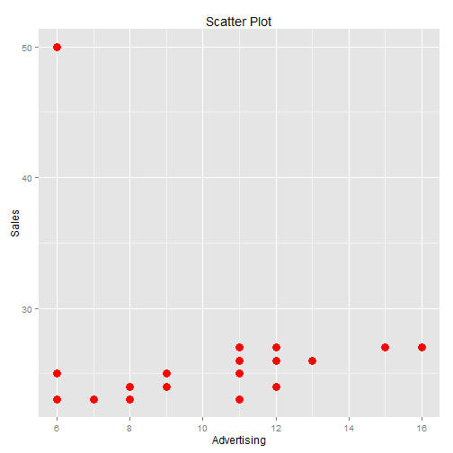
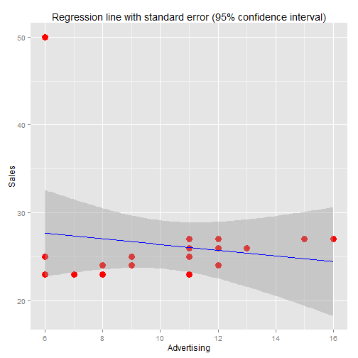
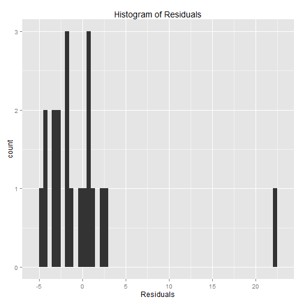
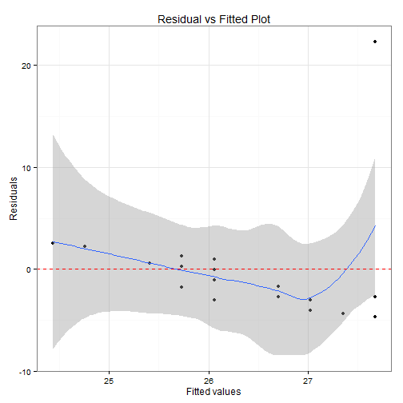
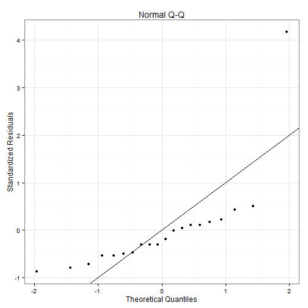
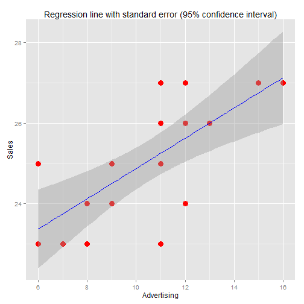
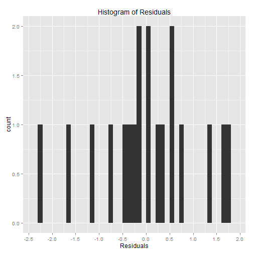
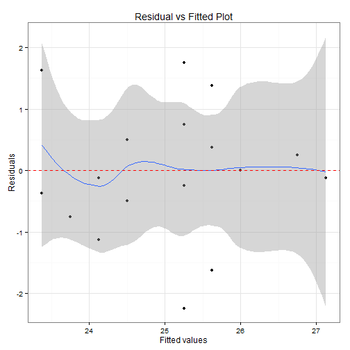
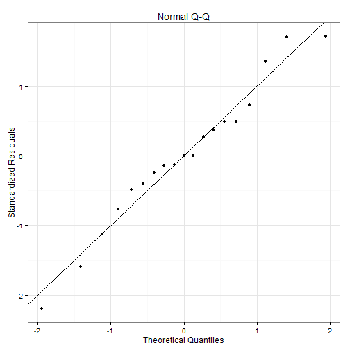

Test Exercise 1: Answers to the Questions
========================================================

This exercise considers an example of data that *do not satisfy* all the standard assumptions of simple regression.
In the considered case, one particular observation lies far off from the others, that is, it is an outlier. This violates
assumptions **A3** and **A4**, which state that all error terms **"\( \varepsilon_i \) are drawn from one and the same distribution with
mean zero and fixed variance \( \sigma^2 \)**. The dataset contains twenty weekly observations on **sales** and **advertising** of a
department store. The question of interest lies in estimating the effect of advertising on sales. One of the weeks
was *special*, as the store was also open in the *evenings* during this week, but this aspect will first be ignored in the
analysis.

* (a) Make the scatter diagram with sales on the vertical axis and advertising on the horizontal axis. What do you expect to find if you would fit a regression line to these data?
  
   
  + It seems that the regression line will be affected heavily by the extreme outlier point and the slope will change lot. Although there seems to be a postive corrleation in between the Advertising and the Sales (increasing Advertising increases Sales), the regression line will fail to capture the functional relationship  in general, as shown below.
  
   

* (b) Estimate the coefficients a and b in the simple regression model with sales as dependent variable and advertising as explanatory factor. Also compute the standard error and t-value of b. Is b significantly different from 0?

  + The equation of the regression line to fit is \(S_i=a+bA_i+\epsilon_i\). The coefficients \(a\) and \(b\) are computed as below, along with the standard error \(s_b\) and t-value \(t_b\) of (\b\). As we can see, with the t-test on \(H_0: \beta = 0 \) based on \(t_b = \frac{b}{s_b}\), we **can't reject the Null Hypothesis \(H_0\)** since \(|t_b| < 2\). Hence, \(b\) is **not significantly different** from \(0\).  
  
  \(\begin{align} 
  b = \frac{\sum\limits_{i}{(S_i-\bar{S})(A_i-\bar{A})}}{\sum\limits_{i}{(A_i-\bar{A})^2}}=r\frac{\sigma_S}{\sigma_A}=-0.324575.\\
  a = \bar{S} - b\bar{A} = 29.62689.\\
  \epsilon_i = S_i - a - bA_i.\\
  s = \sqrt\frac{1}{20-2}\sum\limits_{i=1}^{20}{\epsilon_i^2}=5.836474.\\
  s_b = \frac{s}{\sqrt{\sum\limits_{i=1}^{20}{(A_i-\bar{A})^2}}}=0.458911.\\
  t_b=\frac{b}{s_b}=-0.7072722.
  \end{align}\).
  
  

  
  ```
  ## 
  ## Call:
  ## lm(formula = Sales ~ Advertising, data = df)
  ## 
  ## Residuals:
  ##     Min      1Q  Median      3Q     Max 
  ## -4.6794 -2.7869 -1.3811  0.6803 22.3206 
  ## 
  ## Coefficients:
  ##             Estimate Std. Error t value Pr(>|t|)    
  ## (Intercept)  29.6269     4.8815   6.069 9.78e-06 ***
  ## Advertising  -0.3246     0.4589  -0.707    0.488    
  ## ---
  ## Signif. codes:  0 '***' 0.001 '**' 0.01 '*' 0.05 '.' 0.1 ' ' 1
  ## 
  ## Residual standard error: 5.836 on 18 degrees of freedom
  ## Multiple R-squared:  0.02704,	Adjusted R-squared:  -0.02701 
  ## F-statistic: 0.5002 on 1 and 18 DF,  p-value: 0.4885
  ```

* (c) Compute the residuals and draw a histogram of these residuals. What conclusion do you draw from this histogram?
  
  + As can be seen from the residual values \( \epsilon_i \) and also from the histogram, the residual corresponding to the outlier has an extreme value \(22\) where all the other residuals have values less than \(3\). This outlier point alone makes the distribution *right skewed*.
  
  
  
  ```
  ##  [1] -4.67944359 -4.35486862 -4.03029366 -3.05656878 -3.03029366
  ##  [6] -2.70571870 -2.67944359 -1.73199382 -1.70571870 -1.70571870
  ## [11] -1.05656878 -0.05656878  0.26800618  0.59258114  0.59258114
  ## [16]  0.94343122  1.26800618  2.24173107  2.56630603 22.32055641
  ```
  
     

* (d) Apparently, the regression result of part (b) is not satisfactory. Once you realize that the large residual corresponds to the week with opening hours during the evening, how would you proceed to get a more satisfactory regression model?

  + Since the outlier point skewes the residual hitogram heavily on the right and has a huge impact on the slope of the regression line, it makes sense to delete this outlier point and continue our analysis. Alternatively we can replace Sales corresponding to the outlier point by the median Sales value.


* (e) Delete this special week from the sample and use the remaining 19 weeks to estimate the coefficients a and b in the simple regression model with sales as dependent variable and advertising as explanatory factor. Also compute the standard error and t-value of b. Is b significantly different from 0?

  + As we can see, with the t-test on \(H_0: \beta = 0 \) based on \(t_b = \frac{b}{s_b}\), we can reject the Null Hypothesis \(H_0\) (with \(95%\) confidence) since \(|t_b| > 2\). Hence, \(b\) is **significantly different** from \(0\).  

  \(\begin{align} 
  b = \frac{\sum\limits_{i}{(S_i-\bar{S})(A_i-\bar{A})}}{\sum\limits_{i=1}^{19}{(A_i-\bar{A})^2}}=r\frac{\sigma_S}{\sigma_A}=0.375.\\
  a = \bar{S} - b\bar{A} = 21.125.\\
  \epsilon_i = S_i - a - bA_i.\\
  s = \sqrt\frac{1}{19-2}\sum\limits_{i=1}^{19}{\epsilon_i^2}=1.053705.\\
  s_b = \frac{s}{\sqrt{\sum\limits_{i=1}^{17}{(A_i-\bar{A})^2}}}=0.08819642.\\
  t_b=\frac{b}{s_b}=4.251873.
  \end{align}\).
  
  

  
  ```
  ## 
  ## Call:
  ## lm(formula = Sales ~ Advertising, data = df)
  ## 
  ## Residuals:
  ##     Min      1Q  Median      3Q     Max 
  ## -2.2500 -0.4375  0.0000  0.5000  1.7500 
  ## 
  ## Coefficients:
  ##             Estimate Std. Error t value Pr(>|t|)    
  ## (Intercept)  21.1250     0.9548  22.124 5.72e-14 ***
  ## Advertising   0.3750     0.0882   4.252 0.000538 ***
  ## ---
  ## Signif. codes:  0 '***' 0.001 '**' 0.01 '*' 0.05 '.' 0.1 ' ' 1
  ## 
  ## Residual standard error: 1.054 on 17 degrees of freedom
  ## Multiple R-squared:  0.5154,	Adjusted R-squared:  0.4869 
  ## F-statistic: 18.08 on 1 and 17 DF,  p-value: 0.0005379
  ```
      

* (f) Discuss the differences between your findings in parts (b) and (e). Describe in words what you have learned from these results.

  + The presence of *outliers* (extreme points) in the data can change the linear regression results, it can even change a **statistically significant** independent variable (as found in part (e) with the **outlier point excluded** before the analysis) to a **non-significant** variable (as found in part (b) with the **outlier point included**). Since the outliers can have impact on the coefficients, hence they should be *removed* / replaced (e.g., with with median) first as pre-processing step before analysis. 
```
