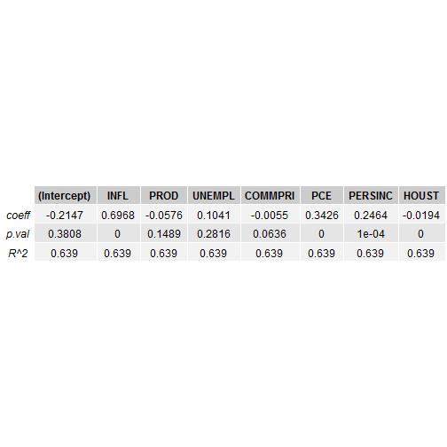
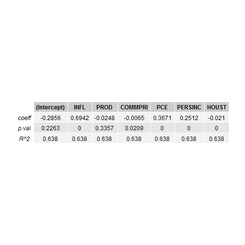
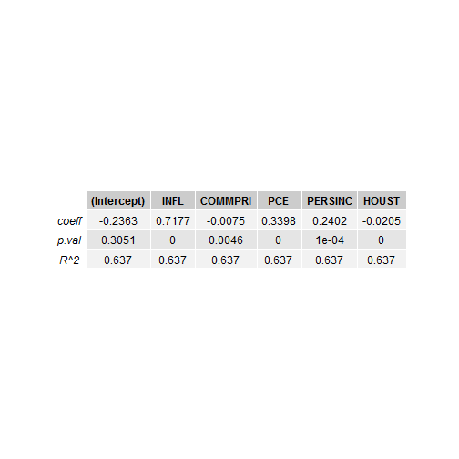
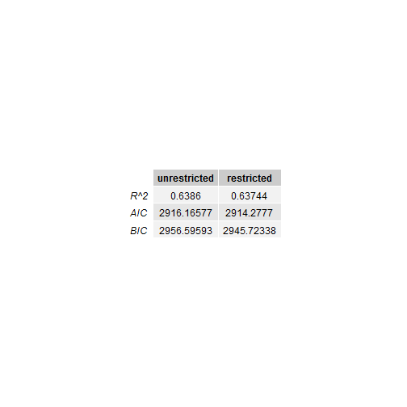
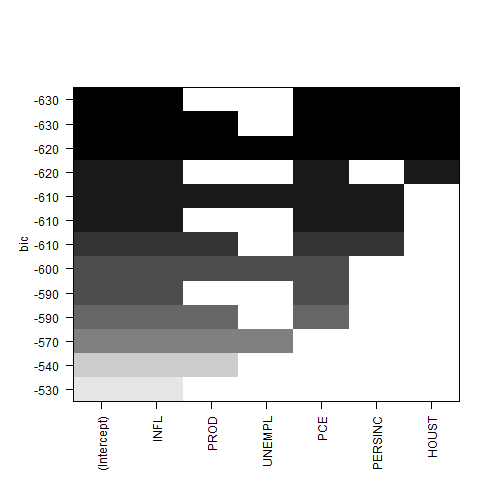
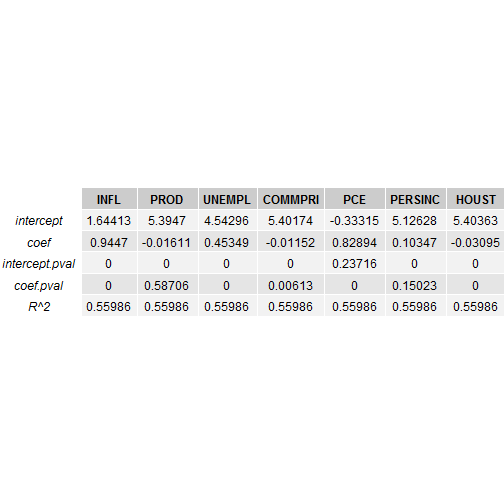
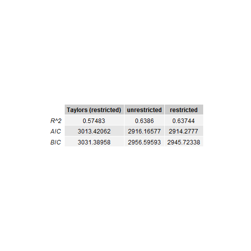

Test Exercise 3: Answers to the Questions
========================================================

* (a) Use *general-to-specific* to come to a model. Start by regressing the *federal funds rate* on the other \(7\) variables
and eliminate \(1\) variable at a time.

+
   

```
## 
## Call:
## lm(formula = INTRATE ~ INFL + COMMPRI + PCE + PERSINC + HOUST, 
##     data = df)
## 
## Residuals:
##     Min      1Q  Median      3Q     Max 
## -7.1918 -1.5298 -0.0974  1.3829  7.6603 
## 
## Coefficients:
##              Estimate Std. Error t value Pr(>|t|)    
## (Intercept) -0.236287   0.230212  -1.026  0.30509    
## INFL         0.717720   0.056972  12.598  < 2e-16 ***
## COMMPRI     -0.007499   0.002639  -2.842  0.00463 ** 
## PCE          0.339822   0.058989   5.761 1.29e-08 ***
## PERSINC      0.240157   0.059265   4.052 5.68e-05 ***
## HOUST       -0.020519   0.004382  -4.682 3.45e-06 ***
## ---
## Signif. codes:  0 '***' 0.001 '**' 0.01 '*' 0.05 '.' 0.1 ' ' 1
## 
## Residual standard error: 2.188 on 654 degrees of freedom
## Multiple R-squared:  0.6374,	Adjusted R-squared:  0.6347 
## F-statistic:   230 on 5 and 654 DF,  p-value: < 2.2e-16
```

```
## Start:  AIC=1041.17
## INTRATE ~ INFL + PROD + UNEMPL + COMMPRI + PCE + PERSINC + HOUST
## 
##           Df Sum of Sq    RSS    AIC
## - UNEMPL   1      5.56 3125.4 1040.3
## <none>                 3119.8 1041.2
## - PROD     1      9.99 3129.8 1041.3
## - COMMPRI  1     16.52 3136.3 1042.7
## - PERSINC  1     79.31 3199.1 1055.7
## - HOUST    1     82.70 3202.5 1056.4
## - PCE      1    117.21 3237.0 1063.5
## - INFL     1    603.72 3723.5 1155.9
## 
## Step:  AIC=1040.34
## INTRATE ~ INFL + PROD + COMMPRI + PCE + PERSINC + HOUST
## 
##           Df Sum of Sq    RSS    AIC
## - PROD     1      4.44 3129.8 1039.3
## <none>                 3125.4 1040.3
## - COMMPRI  1     25.67 3151.0 1043.7
## - PERSINC  1     82.88 3208.2 1055.6
## - HOUST    1    108.45 3233.8 1060.8
## - PCE      1    150.68 3276.0 1069.4
## - INFL     1    600.15 3725.5 1154.3
## 
## Step:  AIC=1039.28
## INTRATE ~ INFL + COMMPRI + PCE + PERSINC + HOUST
## 
##           Df Sum of Sq    RSS    AIC
## <none>                 3129.8 1039.3
## - COMMPRI  1     38.65 3168.4 1045.4
## - PERSINC  1     78.58 3208.4 1053.7
## - HOUST    1    104.91 3234.7 1059.0
## - PCE      1    158.82 3288.6 1070.0
## - INFL     1    759.48 3889.3 1180.7
```

```
## 
## Call:
## lm(formula = INTRATE ~ INFL + COMMPRI + PCE + PERSINC + HOUST, 
##     data = df)
## 
## Coefficients:
## (Intercept)         INFL      COMMPRI          PCE      PERSINC  
##   -0.236287     0.717720    -0.007499     0.339822     0.240157  
##       HOUST  
##   -0.020519
```

```
## Start:  AIC=1077.1
## INTRATE ~ INFL + PROD + UNEMPL + COMMPRI + PCE + PERSINC + HOUST
## 
##           Df Sum of Sq    RSS    AIC
## - UNEMPL   1      5.56 3125.4 1071.8
## - PROD     1      9.99 3129.8 1072.7
## - COMMPRI  1     16.52 3136.3 1074.1
## <none>                 3119.8 1077.1
## - PERSINC  1     79.31 3199.1 1087.2
## - HOUST    1     82.70 3202.5 1087.9
## - PCE      1    117.21 3237.0 1095.0
## - INFL     1    603.72 3723.5 1187.4
## 
## Step:  AIC=1071.79
## INTRATE ~ INFL + PROD + COMMPRI + PCE + PERSINC + HOUST
## 
##           Df Sum of Sq    RSS    AIC
## - PROD     1      4.44 3129.8 1066.2
## - COMMPRI  1     25.67 3151.0 1070.7
## <none>                 3125.4 1071.8
## - PERSINC  1     82.88 3208.2 1082.6
## - HOUST    1    108.45 3233.8 1087.8
## - PCE      1    150.68 3276.0 1096.4
## - INFL     1    600.15 3725.5 1181.2
## 
## Step:  AIC=1066.23
## INTRATE ~ INFL + COMMPRI + PCE + PERSINC + HOUST
## 
##           Df Sum of Sq    RSS    AIC
## <none>                 3129.8 1066.2
## - COMMPRI  1     38.65 3168.4 1067.8
## - PERSINC  1     78.58 3208.4 1076.1
## - HOUST    1    104.91 3234.7 1081.5
## - PCE      1    158.82 3288.6 1092.4
## - INFL     1    759.48 3889.3 1203.1
```

```
## 
## Call:
## lm(formula = INTRATE ~ INFL + COMMPRI + PCE + PERSINC + HOUST, 
##     data = df)
## 
## Coefficients:
## (Intercept)         INFL      COMMPRI          PCE      PERSINC  
##   -0.236287     0.717720    -0.007499     0.339822     0.240157  
##       HOUST  
##   -0.020519
```

 

```
## [1] 1.044838
```

```
## Loading required package: zoo
## 
## Attaching package: 'zoo'
## 
## The following objects are masked from 'package:base':
## 
##     as.Date, as.Date.numeric
```

```
## Wald test
## 
## Model 1: INTRATE ~ INFL + PROD + UNEMPL + COMMPRI + PCE + PERSINC + HOUST
## Model 2: INTRATE ~ INFL + COMMPRI + PCE + PERSINC + HOUST
##   Res.Df Df      F Pr(>F)
## 1    652                 
## 2    654 -2 1.0448 0.3523
```

```
## Analysis of Variance Table
## 
## Model 1: INTRATE ~ INFL + PROD + UNEMPL + COMMPRI + PCE + PERSINC + HOUST
## Model 2: INTRATE ~ INFL + COMMPRI + PCE + PERSINC + HOUST
##   Res.Df    RSS Df Sum of Sq      F Pr(>F)
## 1    652 3119.8                           
## 2    654 3129.8 -2    -9.999 1.0448 0.3523
```

 
 

* (b) Use *specific-to-general* to come to a model. Start by regressing the *federal funds rate* on only a constant and
add \(1\) variable at a time. Is the model the same as in \((a)\)?

+
 

```
## Start:  AIC=1698.89
## INTRATE ~ 1
## 
##           Df Sum of Sq    RSS    AIC
## + INFL     1    4833.0 3799.5 1159.3
## + PCE      1    3625.0 5007.5 1341.5
## + UNEMPL   1     515.5 8117.0 1660.2
## + HOUST    1     329.0 8303.5 1675.2
## + COMMPRI  1      98.0 8534.5 1693.3
## + PERSINC  1      27.1 8605.4 1698.8
## <none>                 8632.5 1698.9
## + PROD     1       3.9 8628.6 1700.6
## 
## Step:  AIC=1159.26
## INTRATE ~ INFL
## 
##           Df Sum of Sq    RSS    AIC
## + PERSINC  1    456.15 3343.4 1076.8
## + PCE      1    383.68 3415.9 1091.0
## + UNEMPL   1    281.56 3518.0 1110.4
## + PROD     1    129.22 3670.3 1138.4
## + COMMPRI  1     16.08 3783.5 1158.5
## <none>                 3799.5 1159.3
## + HOUST    1      4.95 3794.6 1160.4
## 
## Step:  AIC=1076.85
## INTRATE ~ INFL + PERSINC
## 
##           Df Sum of Sq    RSS    AIC
## + PCE      1    58.683 3284.7 1067.2
## + HOUST    1    38.112 3305.3 1071.3
## + UNEMPL   1    35.684 3307.7 1071.8
## + COMMPRI  1    25.996 3317.4 1073.7
## <none>                 3343.4 1076.8
## + PROD     1     0.494 3342.9 1078.8
## 
## Step:  AIC=1067.16
## INTRATE ~ INFL + PERSINC + PCE
## 
##           Df Sum of Sq    RSS    AIC
## + HOUST    1   116.254 3168.4 1045.4
## + COMMPRI  1    49.991 3234.7 1059.0
## + PROD     1    11.147 3273.5 1066.9
## <none>                 3284.7 1067.2
## + UNEMPL   1     7.229 3277.5 1067.7
## 
## Step:  AIC=1045.38
## INTRATE ~ INFL + PERSINC + PCE + HOUST
## 
##           Df Sum of Sq    RSS    AIC
## + COMMPRI  1    38.647 3129.8 1039.3
## + PROD     1    17.416 3151.0 1043.7
## <none>                 3168.4 1045.4
## + UNEMPL   1     0.210 3168.2 1047.3
## 
## Step:  AIC=1039.28
## INTRATE ~ INFL + PERSINC + PCE + HOUST + COMMPRI
## 
##          Df Sum of Sq    RSS    AIC
## <none>                3129.8 1039.3
## + PROD    1    4.4425 3125.3 1040.3
## + UNEMPL  1    0.0077 3129.8 1041.3
```

```
## 
## Call:
## lm(formula = INTRATE ~ INFL + PERSINC + PCE + HOUST + COMMPRI, 
##     data = df)
## 
## Coefficients:
## (Intercept)         INFL      PERSINC          PCE        HOUST  
##   -0.236287     0.717720     0.240157     0.339822    -0.020519  
##     COMMPRI  
##   -0.007499
```

```
## Start:  AIC=1703.39
## INTRATE ~ 1
## 
##           Df Sum of Sq    RSS    AIC
## + INFL     1    4833.0 3799.5 1168.2
## + PCE      1    3625.0 5007.5 1350.5
## + UNEMPL   1     515.5 8117.0 1669.2
## + HOUST    1     329.0 8303.5 1684.2
## + COMMPRI  1      98.0 8534.5 1702.3
## <none>                 8632.5 1703.4
## + PERSINC  1      27.1 8605.4 1707.8
## + PROD     1       3.9 8628.6 1709.6
## 
## Step:  AIC=1168.24
## INTRATE ~ INFL
## 
##           Df Sum of Sq    RSS    AIC
## + PERSINC  1    456.15 3343.4 1090.3
## + PCE      1    383.68 3415.9 1104.5
## + UNEMPL   1    281.56 3518.0 1123.9
## + PROD     1    129.22 3670.3 1151.9
## <none>                 3799.5 1168.2
## + COMMPRI  1     16.08 3783.5 1171.9
## + HOUST    1      4.95 3794.6 1173.9
## 
## Step:  AIC=1090.33
## INTRATE ~ INFL + PERSINC
## 
##           Df Sum of Sq    RSS    AIC
## + PCE      1    58.683 3284.7 1085.1
## + HOUST    1    38.112 3305.3 1089.2
## + UNEMPL   1    35.684 3307.7 1089.7
## <none>                 3343.4 1090.3
## + COMMPRI  1    25.996 3317.4 1091.7
## + PROD     1     0.494 3342.9 1096.7
## 
## Step:  AIC=1085.13
## INTRATE ~ INFL + PERSINC + PCE
## 
##           Df Sum of Sq    RSS    AIC
## + HOUST    1   116.254 3168.4 1067.8
## + COMMPRI  1    49.991 3234.7 1081.5
## <none>                 3284.7 1085.1
## + PROD     1    11.147 3273.5 1089.4
## + UNEMPL   1     7.229 3277.5 1090.2
## 
## Step:  AIC=1067.84
## INTRATE ~ INFL + PERSINC + PCE + HOUST
## 
##           Df Sum of Sq    RSS    AIC
## + COMMPRI  1    38.647 3129.8 1066.2
## <none>                 3168.4 1067.8
## + PROD     1    17.416 3151.0 1070.7
## + UNEMPL   1     0.210 3168.2 1074.3
## 
## Step:  AIC=1066.23
## INTRATE ~ INFL + PERSINC + PCE + HOUST + COMMPRI
## 
##          Df Sum of Sq    RSS    AIC
## <none>                3129.8 1066.2
## + PROD    1    4.4425 3125.3 1071.8
## + UNEMPL  1    0.0077 3129.8 1072.7
```

```
## 
## Call:
## lm(formula = INTRATE ~ INFL + PERSINC + PCE + HOUST + COMMPRI, 
##     data = df)
## 
## Coefficients:
## (Intercept)         INFL      PERSINC          PCE        HOUST  
##   -0.236287     0.717720     0.240157     0.339822    -0.020519  
##     COMMPRI  
##   -0.007499
```

As can be seen from above, 

the **unrestricted model** is \(INTRATE=X_1\beta_1+X_2\beta_2+\epsilon\) and 

the **restricted model** is \(INTRATE=X_1\beta_1+\epsilon\), 

where \(X_1=X(INFL,COMMPRI,PCE,PERSINC,HOUST)\) and \(X_2=X(PROD,UNEMPL)\). 

*Sum of square residual* for the unrestricted model = \(3119.796\), whereas the *Sum of square residual* for the restricted model = \(3129.795\). 

Now the \(F-statistic\) for our hypothesis test \(H_0:\beta_2=0\) against \(H_1:\beta_2 \ne 0\) is \(F = \frac{(R_1^2-R_0^2)/g}{(1-R_1^2)/(n-k)}=\frac{(0.6386-0.63744)/2}{(1-0.6386)/(660-8)}=1.046375\), and the *p-value* is \(0.3517967\) with degrees of freedoms \(2, 653\). Similar results we obtain from **wald test** and **anova**, so we can't reject our **null hypothesis** at 5% significance level, it confirms that we shall be better off without the extra variables (with the **restricted model**).
 
* (c) Compare your model from \((a)\) and the *Taylor rule* of equation \(i_t=\beta_1+\beta_2\pi_t+\beta_3y_t + \epsilon_t\). Consider \(R^2\), *AIC* and *BIC*. Which of the models do you prefer?

+ 
 

```
## 
## Call:
## lm(formula = INTRATE ~ INFL + COMMPRI + PCE + PERSINC + HOUST, 
##     data = df)
## 
## Residuals:
##     Min      1Q  Median      3Q     Max 
## -7.1918 -1.5298 -0.0974  1.3829  7.6603 
## 
## Coefficients:
##              Estimate Std. Error t value Pr(>|t|)    
## (Intercept) -0.236287   0.230212  -1.026  0.30509    
## INFL         0.717720   0.056972  12.598  < 2e-16 ***
## COMMPRI     -0.007499   0.002639  -2.842  0.00463 ** 
## PCE          0.339822   0.058989   5.761 1.29e-08 ***
## PERSINC      0.240157   0.059265   4.052 5.68e-05 ***
## HOUST       -0.020519   0.004382  -4.682 3.45e-06 ***
## ---
## Signif. codes:  0 '***' 0.001 '**' 0.01 '*' 0.05 '.' 0.1 ' ' 1
## 
## Residual standard error: 2.188 on 654 degrees of freedom
## Multiple R-squared:  0.6374,	Adjusted R-squared:  0.6347 
## F-statistic:   230 on 5 and 654 DF,  p-value: < 2.2e-16
```

 

```
## [1] 23.00999
```

```
## [1] 0
```

```
## Wald test
## 
## Model 1: INTRATE ~ INFL + PROD + UNEMPL + COMMPRI + PCE + PERSINC + HOUST
## Model 2: INTRATE ~ INFL + PROD
##   Res.Df Df     F    Pr(>F)    
## 1    652                       
## 2    657 -5 23.01 < 2.2e-16 ***
## ---
## Signif. codes:  0 '***' 0.001 '**' 0.01 '*' 0.05 '.' 0.1 ' ' 1
```

```
## Analysis of Variance Table
## 
## Model 1: INTRATE ~ INFL + PROD + UNEMPL + COMMPRI + PCE + PERSINC + HOUST
## Model 2: INTRATE ~ INFL + PROD
##   Res.Df    RSS Df Sum of Sq     F    Pr(>F)    
## 1    652 3119.8                                 
## 2    657 3670.3 -5   -550.51 23.01 < 2.2e-16 ***
## ---
## Signif. codes:  0 '***' 0.001 '**' 0.01 '*' 0.05 '.' 0.1 ' ' 1
```

```
## Analysis of Variance Table
## 
## Model 1: INTRATE ~ INFL + COMMPRI + PCE + PERSINC + HOUST
## Model 2: INTRATE ~ INFL + PROD
##   Res.Df    RSS Df Sum of Sq      F    Pr(>F)    
## 1    654 3129.8                                  
## 2    657 3670.3 -3   -540.51 37.648 < 2.2e-16 ***
## ---
## Signif. codes:  0 '***' 0.001 '**' 0.01 '*' 0.05 '.' 0.1 ' ' 1
```
Now the \(F-statistic\) for our hypothesis test to test the Taylor's (restricted) model against the unrestricted model, we found \(F = 23.01\), and the *p-value* is \(<0.05\). Similar results we obtain from **wald test** and **anova**, so we can reject our **null hypothesis** at 5% significance level, it confirms that Taylor's model is not better thab the  **unrestricted model**.
 
Similarly with **anova** test we can see that the *p-value* is small, so we can reject the null hypothesis again and conclude that 
Taylor's model is not better thab the  **restricted model** (we can't do **walds test** because these models are not nested).

* (d) Test the *Taylor rule* of equation  \(i_t=\beta_1+\beta_2\pi_t+\beta_3y_t + \epsilon\) using the *RESET test*, *Chow break* and *forecast test* (with in both tests as break date January \(1985\)) and a *Jarque-Bera test*. What do you conclude?

*Sum of square residual* for the unrestricted model = \(S1 = 3119.796\), whereas the *Sum of square residual* for the restricted Taylor's model = \(S0=3670.306\) and the *F-statistic* for the **RESET Test** \(F=\frac{(S_0-S_1)/g}{S_1/(n-k)}=\frac{(3119.796-3670.306)/1}{3119.796/(660-4)}=115.7558\), with *p-value=0*, we can reject the *null hypothesis* at 5% significance level, concluding that *we reject that the model is a  linear regression model*. 

+ 

```
## [1] 115.7558
```

```
## [1] 0
```

+ 

```
## [1] 0.002350634
```

The total *Sum of square residual* for the Taylor's model for *1960:1 - 2014:12* is \(=3670.306\), whereas the *Sum of square residual* before 1985 January (*1960:1 - 1984:12*) \(= S_1 = 1757.802\), whereas the *Sum of square residual* for on or after 1985 January ((*1985:1 - 2014:12*)) \(= S_2=1813.22\). Hence, the *F-statistic* for the **Chow break Test** \(F=\frac{(S_0-(S_1+S_2))/k}{(S_1+S_2)/(n-2*k)}=4.578194\), with *p-value=0.003568257*, we can reject the *null hypothesis* at 5% significance level, concluding that *the model parameters do not suffer from the break*.

The *F-statistic* for the **Chow forecast Test** \(F=\frac{(S_0-S_1)/n_2}{S_1/(n_1-k)}=0.8976073\), with *p-value* as \(0.4422323\), where we have \(n_1=300,\;n_2=360\). The *p-value* is not *significant* at 5% level, hence we can't reject the *null hypothesis* that *there is no structural change in the prediction period*.

The *Jarque-Bera test statistic* is \(JB=\sqrt(\frac{n}{6}S)^2+\sqrt(\frac{n}{24}(K-3))^2=9.171319\), where *skewness* of residuals \(S=0.3213945\) and *kurtosis* \(K=3.164455\), with *p-value* \(0.01019702\) so that we can reject the *null hypothesis* \(H_0\) that residuals are *normally distributed*, at 5% level of significance.
