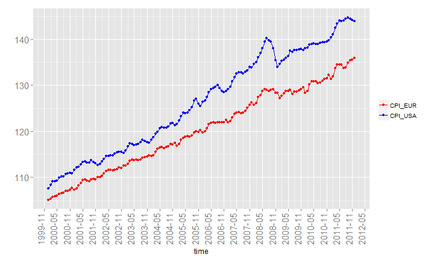
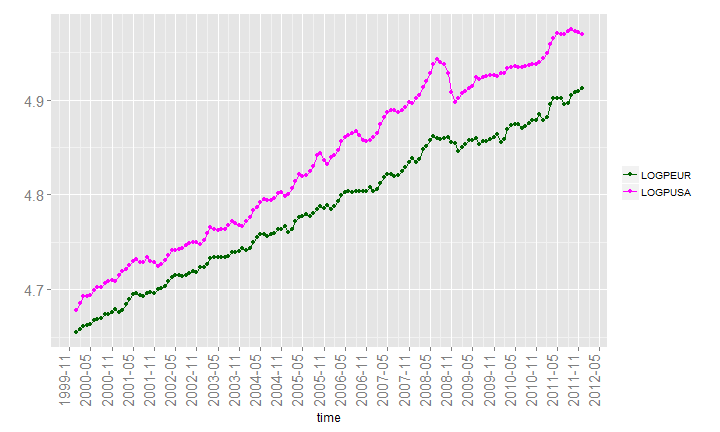
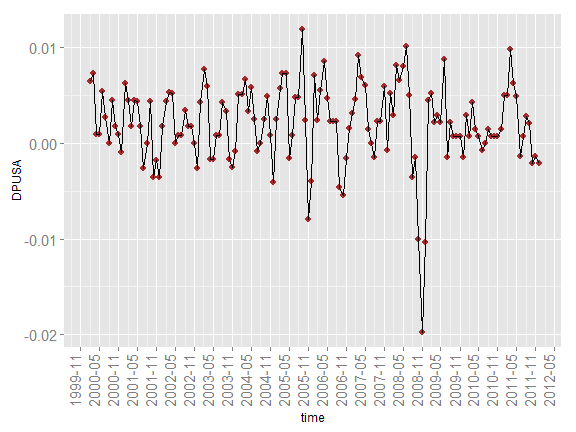
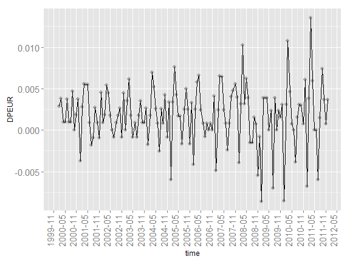
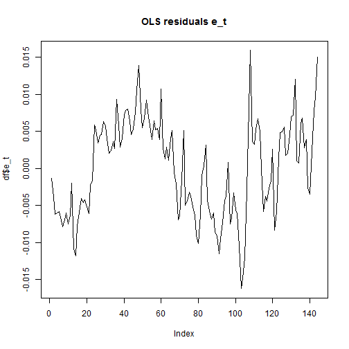
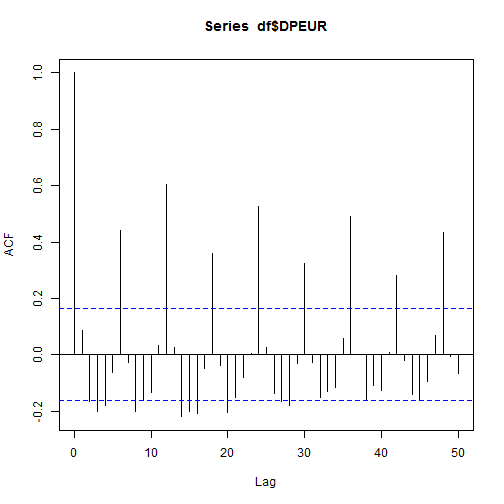
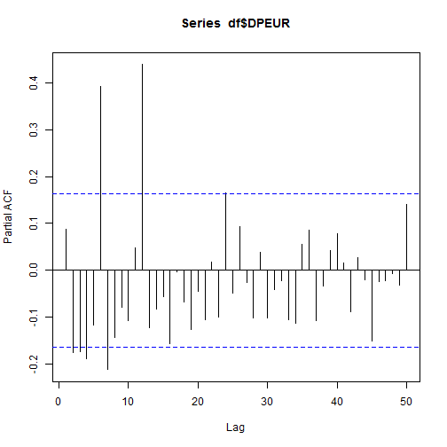
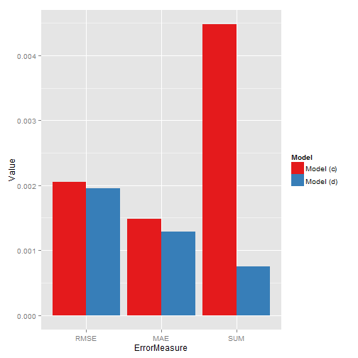
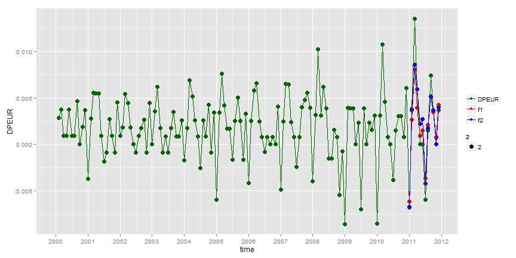

Test Exercise 6: Answers to the Questions
========================================================

* (a) Make time series plots of the *CPI* of the Euro area and the USA, and also of their logarithm \(log(CPI)\) and of
the two monthly inflation series DP = \(\Delta log(CPI)\). What conclusions do you draw from these plots?

  + As can be seen from the following plots, *LOGPUSA* and *LOGPEUR* seem to be *co-integrated* as well (trends in these two time series seem to be similar). To the contrary, *DPEUR* and *DPUSA* seem to be rather *stationary*.
  


 

 

 

 

* (b) Perform the *Augmented Dickey-Fuller (ADF)* test for the two \(log(CPI)\) series. In the *ADF* test equation, include
a constant \(\alpha\), a deterministic trend term \(\beta t\), three lags of \(DP = \Delta log(CPI)\) and, of course, the variable of
interest \(log(CPI_{t-1})\). Report the coefficient of \(log(CPI_{t-1})\)) and its *standard error* and *t-value*, and draw your
conclusion.

  + *Augmented Dicky-Fuller test* results with deterministic trend using the equation \(\Delta log(CPI_t)=\alpha+\beta t + \rho log(CPI_{t-1}  
  ) + \gamma_1 \Delta log(CPI_{t-1}) + \gamma_2 \Delta log(CPI_{t-2}) + \gamma_3 \Delta log(CPI_{t-3}) \), (where \(t\) is the *Trend* 
  variable), we get the following results for \(EUR\) and \(USA\) respectively. 
  
  + From the ADF tests, we have the following results: both the series seem to be **non-stationary**, because we could not reject \(H_0\) of 
  **non-stationarity** (Since we can only reject \(H_0\) if t-value < -3.5).
  
   \(
    \begin{align*}
    Series && Coeff   && S.E.   && t-value && Reject\;H_0 \\
    EUR    && -0.1374 && 0.0486 && -2.826 && FALSE \\
    USA    && -0.07434 && 0.02719 && -2.735 && FALSE \\
    \end{align*}    
    \)
  
    
    ```
    ## 
    ## Call:
    ## lm(formula = DPEUR ~ TREND + LOGPEURt_1 + DPEUR_1 + DPEUR_2 + 
    ##     DPEUR_3, data = df)
    ## 
    ## Residuals:
    ##        Min         1Q     Median         3Q        Max 
    ## -0.0112018 -0.0015085  0.0002827  0.0020131  0.0096450 
    ## 
    ## Coefficients:
    ##               Estimate Std. Error t value Pr(>|t|)   
    ## (Intercept)  6.420e-01  2.263e-01   2.837  0.00526 **
    ## TREND        2.374e-04  8.496e-05   2.795  0.00596 **
    ## LOGPEURt_1  -1.374e-01  4.860e-02  -2.826  0.00543 **
    ## DPEUR_1      1.442e-01  8.665e-02   1.665  0.09833 . 
    ## DPEUR_2     -9.022e-02  8.521e-02  -1.059  0.29160   
    ## DPEUR_3     -1.128e-01  8.565e-02  -1.317  0.19002   
    ## ---
    ## Signif. codes:  0 '***' 0.001 '**' 0.01 '*' 0.05 '.' 0.1 ' ' 1
    ## 
    ## Residual standard error: 0.00336 on 134 degrees of freedom
    ##   (4 observations deleted due to missingness)
    ## Multiple R-squared:  0.1202,	Adjusted R-squared:  0.0874 
    ## F-statistic: 3.663 on 5 and 134 DF,  p-value: 0.003875
    ```
    
    
    ```
    ## 
    ## Call:
    ## lm(formula = DPUSA ~ TREND + LOGPUSAt_1 + DPUSA_1 + DPUSA_2 + 
    ##     DPUSA_3, data = df)
    ## 
    ## Residuals:
    ##        Min         1Q     Median         3Q        Max 
    ## -0.0131466 -0.0018596 -0.0001258  0.0019564  0.0088758 
    ## 
    ## Coefficients:
    ##               Estimate Std. Error t value Pr(>|t|)    
    ## (Intercept)  3.494e-01  1.272e-01   2.747  0.00684 ** 
    ## TREND        1.514e-04  5.723e-05   2.645  0.00914 ** 
    ## LOGPUSAt_1  -7.434e-02  2.719e-02  -2.735  0.00709 ** 
    ## DPUSA_1      6.091e-01  8.404e-02   7.248 3.03e-11 ***
    ## DPUSA_2     -1.513e-01  9.650e-02  -1.567  0.11936    
    ## DPUSA_3     -6.450e-03  8.623e-02  -0.075  0.94048    
    ## ---
    ## Signif. codes:  0 '***' 0.001 '**' 0.01 '*' 0.05 '.' 0.1 ' ' 1
    ## 
    ## Residual standard error: 0.003506 on 134 degrees of freedom
    ##   (4 observations deleted due to missingness)
    ## Multiple R-squared:  0.3261,	Adjusted R-squared:  0.3009 
    ## F-statistic: 12.97 on 5 and 134 DF,  p-value: 2.721e-10
    ```

* (c) As the two series of \(log(CPI)\) are not cointegrated (you need not check this), we continue by modelling the
monthly inflation series \(DPEUR = \Delta log(CPIEUR)\) for the Euro area. Determine the sample *autocorrelations*
and the sample *partial autocorrelations* of this series to motivate the use of the following *AR* model: \(DPEUR_t =
\alpha+\beta_1 DPEUR_{t-6}+\beta_2 DPEUR_{t-12}+\epsilon_t\) . Estimate the parameters of this model (sample Jan 2000 - Dec 2010).

  + **Engle-Granger** test for cointegration:

    
  + **STEP1**: **OLS** in \(log(LOGPEUR_t) = \alpha + \beta log(LOGPUSA_t)  + \epsilon_t\)
  

    
    ```
    ## 
    ## Call:
    ## lm(formula = LOGPEUR ~ LOGPUSA, data = df)
    ## 
    ## Residuals:
    ##        Min         1Q     Median         3Q        Max 
    ## -0.0162208 -0.0058057  0.0009227  0.0052236  0.0159064 
    ## 
    ## Coefficients:
    ##             Estimate Std. Error t value Pr(>|t|)    
    ## (Intercept) 0.770298   0.030019   25.66   <2e-16 ***
    ## LOGPUSA     0.830604   0.006207  133.82   <2e-16 ***
    ## ---
    ## Signif. codes:  0 '***' 0.001 '**' 0.01 '*' 0.05 '.' 0.1 ' ' 1
    ## 
    ## Residual standard error: 0.006504 on 142 degrees of freedom
    ## Multiple R-squared:  0.9921,	Adjusted R-squared:  0.9921 
    ## F-statistic: 1.791e+04 on 1 and 142 DF,  p-value: < 2.2e-16
    ```
    
     

  + **STEP2** Cointegrated if **ADF test** on \(\epsilon_t\) rejects **non-stationarity**, where the equation for the ADF test
    to be used \(\Delta e_t = \alpha + \rho e_{t-1} + \gamma_1 \Delta e_{t-1} + \gamma_2 \Delta e_{t-2}\). Residuals don't seem to have
    any **deterministic trend**, hence using ADF test with 2 lags, without deterministic trend term, we get the coeff -0.1693457, S.E.0
    .0553325 and t-value -3.061 > -3.5, the critical value, so we could not reject \(H_0\), hence the two series are **not cointegrated**.


  
    
    ```
    ## 
    ## Call:
    ## lm(formula = d_e_t ~ e_t_1 + d_e_t_1 + d_e_t_2, data = df)
    ## 
    ## Residuals:
    ##        Min         1Q     Median         3Q        Max 
    ## -0.0109148 -0.0017199  0.0000278  0.0018519  0.0098065 
    ## 
    ## Coefficients:
    ##               Estimate Std. Error t value Pr(>|t|)   
    ## (Intercept)  0.0001357  0.0003176   0.427  0.66980   
    ## e_t_1       -0.1693457  0.0553325  -3.061  0.00266 **
    ## d_e_t_1      0.0836256  0.0867792   0.964  0.33691   
    ## d_e_t_2     -0.0865832  0.0865359  -1.001  0.31881   
    ## ---
    ## Signif. codes:  0 '***' 0.001 '**' 0.01 '*' 0.05 '.' 0.1 ' ' 1
    ## 
    ## Residual standard error: 0.003768 on 137 degrees of freedom
    ##   (3 observations deleted due to missingness)
    ## Multiple R-squared:  0.09186,	Adjusted R-squared:  0.07198 
    ## F-statistic: 4.619 on 3 and 137 DF,  p-value: 0.004128
    ```
      
   + **ACF** and **PACF** plots:As can be seen from the below plots, ACF values does not get insignificant till lag 50, but PACF values get 
   insignificant after \(p=12\). Only 2 **lag** values for which **PACF** has significant values are 6 and 12. Hence, we can use the *AR* 
   model \(DPEUR_t = \alpha+\beta_1 DPEUR_{t-6}+\beta_2 DPEUR_{t-12}+\epsilon_t\). The estimates for the parameters of the model are shown 
   below, we can see both the coefficients at lag 6 and 12 are significant at \(5\%\) level.
   
     
     
     
    
    ```
    ## 
    ## Call:
    ## lm(formula = DPEUR ~ DPEUR_6 + DPEUR_12, data = df)
    ## 
    ## Residuals:
    ##        Min         1Q     Median         3Q        Max 
    ## -0.0106987 -0.0016514 -0.0001211  0.0014451  0.0079469 
    ## 
    ## Coefficients:
    ##              Estimate Std. Error t value Pr(>|t|)    
    ## (Intercept) 0.0002776  0.0002610   1.064  0.28954    
    ## DPEUR_6     0.2070482  0.0693459   2.986  0.00339 ** 
    ## DPEUR_12    0.6618626  0.0748732   8.840 6.42e-15 ***
    ## ---
    ## Signif. codes:  0 '***' 0.001 '**' 0.01 '*' 0.05 '.' 0.1 ' ' 1
    ## 
    ## Residual standard error: 0.002535 on 128 degrees of freedom
    ##   (13 observations deleted due to missingness)
    ## Multiple R-squared:  0.507,	Adjusted R-squared:  0.4993 
    ## F-statistic: 65.81 on 2 and 128 DF,  p-value: < 2.2e-16
    ```
    
* (d) Extend the AR model of part *(c)* by adding lagged values of monthly inflation in the USA at lags *1, 6,*
and *12*. Check that the *coefficient* at *lag 6* is not *significant*, and estimate the *ADL* model \(DPEUR_t =
\alpha+\beta_1 DPEUR_{t-6}+\beta_2 DPEUR_{t-12}+\gamma_1 DPUSA_{t-1}+\gamma_2 DPUSA_{t-12}+\epsilon_t\) (sample Jan 2000 - Dec 2010).

  + The **ADL** model parameters are estimated below. As can be seen, the *coefficient* at *lag 6* is not *significant* at \(5\%\) level.
  
    
    ```
    ## 
    ## Call:
    ## lm(formula = DPEUR ~ DPEUR_6 + DPEUR_12 + DPUSA_1 + DPUSA_6 + 
    ##     DPUSA_12, data = df)
    ## 
    ## Residuals:
    ##        Min         1Q     Median         3Q        Max 
    ## -0.0069414 -0.0016374 -0.0000405  0.0011089  0.0081291 
    ## 
    ## Coefficients:
    ##               Estimate Std. Error t value Pr(>|t|)    
    ## (Intercept)  0.0003462  0.0002719   1.273  0.20527    
    ## DPEUR_6      0.2032964  0.0707234   2.875  0.00476 ** 
    ## DPEUR_12     0.6995076  0.0773015   9.049 2.36e-15 ***
    ## DPUSA_1      0.2195443  0.0489174   4.488 1.61e-05 ***
    ## DPUSA_6     -0.0484667  0.0531548  -0.912  0.36363    
    ## DPUSA_12    -0.2355513  0.0525563  -4.482 1.65e-05 ***
    ## ---
    ## Signif. codes:  0 '***' 0.001 '**' 0.01 '*' 0.05 '.' 0.1 ' ' 1
    ## 
    ## Residual standard error: 0.002251 on 125 degrees of freedom
    ##   (13 observations deleted due to missingness)
    ## Multiple R-squared:  0.6202,	Adjusted R-squared:  0.6051 
    ## F-statistic: 40.83 on 5 and 125 DF,  p-value: < 2.2e-16
    ```

* (e) Use the models of parts *(c)* and *(d)* to make two series of 12 monthly inflation forecasts for 2011. At each
month, you should use the data that are then available, for example, to forecast inflation for September 2011
you can use the data up to and including August 2011. However, do not re-estimate the model and use the
coefficients as obtained in parts *(c)* and *(d)*. For each of the two forecast series, compute the values of the root
mean squared error *(RMSE)*, mean absolute error *(MAE)*, and the sum of the forecast errors *(SUM)*. Finally,
give your interpretation of the outcomes.

  + The following figures show the two forecast series, along with the forecast errors. As can be seen from the plots and error values,
    the model (d) with ADL terms performs much better than the model (c) without ADL terms.
  
    
    ```
    ## [1] "Model (c) RMSE 0.00205394857121524"
    ```
    
    ```
    ## [1] "Model (d) RMSE 0.00195668940303628"
    ```
    
    ```
    ## [1] "Model (c) MAE 0.0014851037370355"
    ```
    
    ```
    ## [1] "Model (d) MAE 0.00128424025836032"
    ```
    
    ```
    ## [1] "Model (c) SUM 0.00447598968864595"
    ```
    
    ```
    ## [1] "Model (d) SUM 0.000749602989481903"
    ```
    
     
     
    
