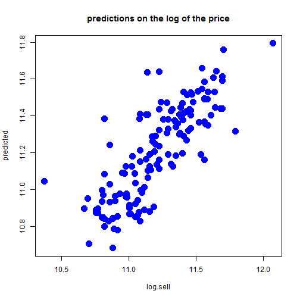

Case Project - House Prices: Answers to the Questions
========================================================

**Questions**

* (a) Consider a *linear model* where the sale price of a house is the dependent variable and the explanatory variables
are the other variables given above. Perform a test for linearity. What do you conclude based on the test result?

  + Let's fit an *OLS* model with the dependent variable *sell*, we  obtain the following result.

  
  ```
  ## 
  ## Call:
  ## lm(formula = sell ~ ., data = df)
  ## 
  ## Residuals:
  ##    Min     1Q Median     3Q    Max 
  ## -41389  -9307   -591   7353  74875 
  ## 
  ## Coefficients:
  ##               Estimate Std. Error t value Pr(>|t|)    
  ## (Intercept) -4038.3504  3409.4713  -1.184 0.236762    
  ## lot             3.5463     0.3503  10.124  < 2e-16 ***
  ## bdms         1832.0035  1047.0002   1.750 0.080733 .  
  ## fb          14335.5585  1489.9209   9.622  < 2e-16 ***
  ## sty          6556.9457   925.2899   7.086 4.37e-12 ***
  ## drv          6687.7789  2045.2458   3.270 0.001145 ** 
  ## rec          4511.2838  1899.9577   2.374 0.017929 *  
  ## ffin         5452.3855  1588.0239   3.433 0.000642 ***
  ## ghw         12831.4063  3217.5971   3.988 7.60e-05 ***
  ## ca          12632.8904  1555.0211   8.124 3.15e-15 ***
  ## gar          4244.8290   840.5442   5.050 6.07e-07 ***
  ## reg          9369.5132  1669.0907   5.614 3.19e-08 ***
  ## ---
  ## Signif. codes:  0 '***' 0.001 '**' 0.01 '*' 0.05 '.' 0.1 ' ' 1
  ## 
  ## Residual standard error: 15420 on 534 degrees of freedom
  ## Multiple R-squared:  0.6731,	Adjusted R-squared:  0.6664 
  ## F-statistic: 99.97 on 11 and 534 DF,  p-value: < 2.2e-16
  ```

  + Next let's perform the *RESET* test (by adding fitted values of the dependent) to test the linearity with \(p=1\) and get the following 
  result. As we can see, we get the *test-statistic=26.986*, with *p-value* \(\approx 0\), so that we **can reject** \(H_0\)of *linearity* 
  and conlude that the model is **non-linear**.

    
    ```
    ## 
    ## 	RESET test
    ## 
    ## data:  sell ~ .
    ## RESET = 26.986, df1 = 1, df2 = 533, p-value = 2.922e-07
    ```

* (b) Now consider a linear model where the log of the sale price of the house is the dependent variable and the
  explanatory variables are as before. Perform again the test for linearity. What do you conclude now?

 + Let's again fit an *OLS* model with the dependent variable *log(sell)*, we  obtain the following result.

    
    ```
    ## 
    ## Call:
    ## lm(formula = log.sell ~ ., data = df)
    ## 
    ## Residuals:
    ##      Min       1Q   Median       3Q      Max 
    ## -0.67865 -0.12211  0.01666  0.12868  0.67737 
    ## 
    ## Coefficients:
    ##              Estimate Std. Error t value Pr(>|t|)    
    ## (Intercept) 1.003e+01  4.724e-02 212.210  < 2e-16 ***
    ## lot         5.057e-05  4.854e-06  10.418  < 2e-16 ***
    ## bdms        3.402e-02  1.451e-02   2.345  0.01939 *  
    ## fb          1.678e-01  2.065e-02   8.126 3.10e-15 ***
    ## sty         9.227e-02  1.282e-02   7.197 2.10e-12 ***
    ## drv         1.307e-01  2.834e-02   4.610 5.04e-06 ***
    ## rec         7.352e-02  2.633e-02   2.792  0.00542 ** 
    ## ffin        9.940e-02  2.200e-02   4.517 7.72e-06 ***
    ## ghw         1.784e-01  4.458e-02   4.000 7.22e-05 ***
    ## ca          1.780e-01  2.155e-02   8.262 1.14e-15 ***
    ## gar         5.076e-02  1.165e-02   4.358 1.58e-05 ***
    ## reg         1.271e-01  2.313e-02   5.496 6.02e-08 ***
    ## ---
    ## Signif. codes:  0 '***' 0.001 '**' 0.01 '*' 0.05 '.' 0.1 ' ' 1
    ## 
    ## Residual standard error: 0.2137 on 534 degrees of freedom
    ## Multiple R-squared:  0.6766,	Adjusted R-squared:  0.6699 
    ## F-statistic: 101.6 on 11 and 534 DF,  p-value: < 2.2e-16
    ```

  + Next let's perform the *RESET* test (by adding fitted values of the dependent) to test the linearity with \(p=1\) and get the following 
  result. As we can see, we get the *test-statistic=0.2703*, with *p-value* \(> 0.05\), so we **can not reject** \(H_0\)of linearity and 
  conlude that the model is **linear**.

    
    ```
    ## 
    ## 	RESET test
    ## 
    ## data:  log.sell ~ .
    ## RESET = 0.2703, df1 = 1, df2 = 533, p-value = 0.6033
    ```

* (c) Continue with the linear model from question (b). We now consider possible transformation of the lot size variable. We can consider 
      either the variable itself, or a log transformation of this variable. Which of these do you prefer? (Keep all other explanatory 
      variables included without transformation.)

  + Let's now fit an *OLS* model this time with the explanatory variable *log(lot)* instead of *lot*, we  obtain the following result.
  
    
    ```
    ## 
    ## Call:
    ## lm(formula = log.sell ~ ., data = df1)
    ## 
    ## Residuals:
    ##      Min       1Q   Median       3Q      Max 
    ## -0.68355 -0.12247  0.00802  0.12780  0.67564 
    ## 
    ## Coefficients:
    ##             Estimate Std. Error t value Pr(>|t|)    
    ## (Intercept)  7.74509    0.21634  35.801  < 2e-16 ***
    ## bdms         0.03440    0.01427   2.410 0.016294 *  
    ## fb           0.16576    0.02033   8.154 2.52e-15 ***
    ## sty          0.09169    0.01261   7.268 1.30e-12 ***
    ## drv          0.11020    0.02823   3.904 0.000107 ***
    ## rec          0.05797    0.02605   2.225 0.026482 *  
    ## ffin         0.10449    0.02169   4.817 1.90e-06 ***
    ## ghw          0.17902    0.04389   4.079 5.22e-05 ***
    ## ca           0.16642    0.02134   7.799 3.29e-14 ***
    ## gar          0.04795    0.01148   4.178 3.43e-05 ***
    ## reg          0.13185    0.02267   5.816 1.04e-08 ***
    ## log.lot      0.30313    0.02669  11.356  < 2e-16 ***
    ## ---
    ## Signif. codes:  0 '***' 0.001 '**' 0.01 '*' 0.05 '.' 0.1 ' ' 1
    ## 
    ## Residual standard error: 0.2104 on 534 degrees of freedom
    ## Multiple R-squared:  0.6865,	Adjusted R-squared:  0.6801 
    ## F-statistic: 106.3 on 11 and 534 DF,  p-value: < 2.2e-16
    ```
    
  + **Model Selection** by comparing \(R^2\), *AIC* and *BIC* of the two models: As shown below, the model with \(log(lot)\) as 
  explanatory variable has higer \(R^2\), lower *AIC* and *BIC* values, indicating better fit, so I shall prefer this model.
    
  \(
      \begin{align*}
      Measure && Model_{lot} && Model_{log(lot)} \\
      R^2 &&  0.676591 && 0.6865496 \\
      AIC &&  -121.7462 && -138.8234 \\
      BIC &&  -65.81219 && -82.88931
      \end{align*}
    \)
    
    
* (d) Consider now a model where the log of the sale price of the house is the dependent variable and the explanatory variables are the log 
  transformation of lot size, with all other explanatory variables as before. We now consider interaction effects of the log lot size with 
  the other variables. Construct these interaction variables. How many are individually significant?

  + Let's fit an *OLS* model this time with the explanatory variable *log(lot)* and with *interaction effects* with other regressors, we  
  obtain the following result. As can be seen only two variables *drv* and *rec* are individually signifcant at \(5\%\) level and 
  the interaction effects of *log lot size* with these two variables *drv* and *rec* are also significant.
  
     
     ```
     ## 
     ## Call:
     ## lm(formula = log.sell ~ . + log.lot:bdms + log.lot:fb + log.lot:sty + 
     ##     log.lot:drv + log.lot:rec + log.lot:ffin + log.lot:ghw + 
     ##     log.lot:ca + log.lot:gar + log.lot:reg, data = df1)
     ## 
     ## Residuals:
     ##      Min       1Q   Median       3Q      Max 
     ## -0.68306 -0.11612  0.00591  0.12486  0.65998 
     ## 
     ## Coefficients:
     ##               Estimate Std. Error t value Pr(>|t|)    
     ## (Intercept)   8.966499   1.070667   8.375 5.09e-16 ***
     ## bdms          0.019075   0.326700   0.058   0.9535    
     ## fb           -0.368234   0.429048  -0.858   0.3911    
     ## sty           0.488885   0.309700   1.579   0.1150    
     ## drv          -1.463371   0.717225  -2.040   0.0418 *  
     ## rec           1.673992   0.655919   2.552   0.0110 *  
     ## ffin         -0.031844   0.445543  -0.071   0.9430    
     ## ghw          -0.505889   0.902733  -0.560   0.5754    
     ## ca           -0.340276   0.496041  -0.686   0.4930    
     ## gar           0.401941   0.258646   1.554   0.1208    
     ## reg           0.118484   0.479856   0.247   0.8051    
     ## log.lot       0.152685   0.128294   1.190   0.2345    
     ## bdms:log.lot  0.002070   0.038654   0.054   0.9573    
     ## fb:log.lot    0.062037   0.050145   1.237   0.2166    
     ## sty:log.lot  -0.046361   0.035942  -1.290   0.1977    
     ## drv:log.lot   0.191542   0.087361   2.193   0.0288 *  
     ## rec:log.lot  -0.188462   0.076373  -2.468   0.0139 *  
     ## ffin:log.lot  0.015913   0.052851   0.301   0.7635    
     ## ghw:log.lot   0.081135   0.106929   0.759   0.4483    
     ## ca:log.lot    0.059549   0.058024   1.026   0.3052    
     ## gar:log.lot  -0.041359   0.030142  -1.372   0.1706    
     ## reg:log.lot   0.001515   0.055990   0.027   0.9784    
     ## ---
     ## Signif. codes:  0 '***' 0.001 '**' 0.01 '*' 0.05 '.' 0.1 ' ' 1
     ## 
     ## Residual standard error: 0.2095 on 524 degrees of freedom
     ## Multiple R-squared:  0.6951,	Adjusted R-squared:  0.6829 
     ## F-statistic: 56.89 on 21 and 524 DF,  p-value: < 2.2e-16
     ```
     
* (e) Perform an F-test for the joint significance of the interaction effects from question (d).

  + Treating the model without interaction terms as the *restricted model* and the model with the interaction terms as the *unrestricted 
  model*, The *F statistic* for the joint significance of the interaction effects = \(\frac{(R_1^2 - R_0^2)/g}{(1-R_1^2)/(n-k)}\), here \(g
  =10,\; k=22,\; n=546, \; R_1^2=0.6951, \; R_0^2=0.6865\). Hence, the *F-Statistic* = 1.477993, the \(5\%\) critical value of \(F(g, n-k)=
  1.848767\). Since \(1.477993 < 1.848767\), we can't reject \(H_0\). Hence, the the interaction effects are not jointly significant and the 
  we shall be better off by exluding the interaction effects.

* (f) Now perform model specification on the interaction variables using the general-to-specific approach. (Only eliminate the interaction 
  effects.)

  + Using *general to specific approach*, we have the following result shown below. Using \(R^2\) we can see all the variables are 
  significant at \(5\%\) level, so could not reduce the model further. But using *AIC* and *BIC*, the explanatory variables *rec* and *bdms* 
  got eliminated from the final model.
  
      
      ```
      ## 
      ## Call:
      ## lm(formula = log.sell ~ bdms + fb + sty + drv + rec + ffin + 
      ##     ghw + ca + gar + reg + log.lot, data = df1)
      ## 
      ## Residuals:
      ##      Min       1Q   Median       3Q      Max 
      ## -0.68355 -0.12247  0.00802  0.12780  0.67564 
      ## 
      ## Coefficients:
      ##             Estimate Std. Error t value Pr(>|t|)    
      ## (Intercept)  7.74509    0.21634  35.801  < 2e-16 ***
      ## bdms         0.03440    0.01427   2.410 0.016294 *  
      ## fb           0.16576    0.02033   8.154 2.52e-15 ***
      ## sty          0.09169    0.01261   7.268 1.30e-12 ***
      ## drv          0.11020    0.02823   3.904 0.000107 ***
      ## rec          0.05797    0.02605   2.225 0.026482 *  
      ## ffin         0.10449    0.02169   4.817 1.90e-06 ***
      ## ghw          0.17902    0.04389   4.079 5.22e-05 ***
      ## ca           0.16642    0.02134   7.799 3.29e-14 ***
      ## gar          0.04795    0.01148   4.178 3.43e-05 ***
      ## reg          0.13185    0.02267   5.816 1.04e-08 ***
      ## log.lot      0.30313    0.02669  11.356  < 2e-16 ***
      ## ---
      ## Signif. codes:  0 '***' 0.001 '**' 0.01 '*' 0.05 '.' 0.1 ' ' 1
      ## 
      ## Residual standard error: 0.2104 on 534 degrees of freedom
      ## Multiple R-squared:  0.6865,	Adjusted R-squared:  0.6801 
      ## F-statistic: 106.3 on 11 and 534 DF,  p-value: < 2.2e-16
      ```
      
      ```
      ## Start:  AIC=-1690.3
      ## log.sell ~ bdms + fb + sty + drv + rec + ffin + ghw + ca + gar + 
      ##     reg + log.lot
      ## 
      ##           Df Sum of Sq    RSS     AIC
      ## <none>                 23.638 -1690.3
      ## - rec      1    0.2192 23.858 -1687.3
      ## - bdms     1    0.2571 23.895 -1686.4
      ## - drv      1    0.6748 24.313 -1676.9
      ## - ghw      1    0.7364 24.375 -1675.5
      ## - gar      1    0.7729 24.411 -1674.7
      ## - ffin     1    1.0271 24.665 -1669.1
      ## - reg      1    1.4975 25.136 -1658.8
      ## - sty      1    2.3385 25.977 -1640.8
      ## - ca       1    2.6926 26.331 -1633.4
      ## - fb       1    2.9434 26.582 -1628.2
      ## - log.lot  1    5.7085 29.347 -1574.2
      ```
      
      ```
      ## 
      ## Call:
      ## lm(formula = log.sell ~ bdms + fb + sty + drv + rec + ffin + 
      ##     ghw + ca + gar + reg + log.lot, data = df1)
      ## 
      ## Coefficients:
      ## (Intercept)         bdms           fb          sty          drv  
      ##     7.74509      0.03440      0.16576      0.09169      0.11020  
      ##         rec         ffin          ghw           ca          gar  
      ##     0.05797      0.10449      0.17902      0.16642      0.04795  
      ##         reg      log.lot  
      ##     0.13185      0.30313
      ```
      
      ```
      ## Start:  AIC=-1638.67
      ## log.sell ~ bdms + fb + sty + drv + rec + ffin + ghw + ca + gar + 
      ##     reg + log.lot
      ## 
      ##           Df Sum of Sq    RSS     AIC
      ## - rec      1    0.2192 23.858 -1639.9
      ## - bdms     1    0.2571 23.895 -1639.1
      ## <none>                 23.638 -1638.7
      ## - drv      1    0.6748 24.313 -1629.6
      ## - ghw      1    0.7364 24.375 -1628.2
      ## - gar      1    0.7729 24.411 -1627.4
      ## - ffin     1    1.0271 24.665 -1621.8
      ## - reg      1    1.4975 25.136 -1611.4
      ## - sty      1    2.3385 25.977 -1593.5
      ## - ca       1    2.6926 26.331 -1586.1
      ## - fb       1    2.9434 26.582 -1580.9
      ## - log.lot  1    5.7085 29.347 -1526.9
      ## 
      ## Step:  AIC=-1639.94
      ## log.sell ~ bdms + fb + sty + drv + ffin + ghw + ca + gar + reg + 
      ##     log.lot
      ## 
      ##           Df Sum of Sq    RSS     AIC
      ## - bdms     1    0.2460 24.104 -1640.6
      ## <none>                 23.858 -1639.9
      ## - drv      1    0.6873 24.545 -1630.7
      ## - gar      1    0.7294 24.587 -1629.8
      ## - ghw      1    0.7376 24.595 -1629.6
      ## - reg      1    1.5446 25.402 -1612.0
      ## - ffin     1    1.5878 25.445 -1611.1
      ## - sty      1    2.4365 26.294 -1593.1
      ## - ca       1    2.7991 26.657 -1585.7
      ## - fb       1    3.0171 26.875 -1581.2
      ## - log.lot  1    6.1213 29.979 -1521.5
      ## 
      ## Step:  AIC=-1640.64
      ## log.sell ~ fb + sty + drv + ffin + ghw + ca + gar + reg + log.lot
      ## 
      ##           Df Sum of Sq    RSS     AIC
      ## <none>                 24.104 -1640.6
      ## - drv      1    0.6003 24.704 -1633.5
      ## - ghw      1    0.7559 24.859 -1630.1
      ## - gar      1    0.8023 24.906 -1629.1
      ## - reg      1    1.5752 25.679 -1612.4
      ## - ffin     1    1.8086 25.912 -1607.4
      ## - ca       1    2.7778 26.881 -1587.4
      ## - sty      1    3.4365 27.540 -1574.2
      ## - fb       1    3.6023 27.706 -1570.9
      ## - log.lot  1    6.3271 30.430 -1519.7
      ```
      
      ```
      ## 
      ## Call:
      ## lm(formula = log.sell ~ fb + sty + drv + ffin + ghw + ca + gar + 
      ##     reg + log.lot, data = df1)
      ## 
      ## Coefficients:
      ## (Intercept)           fb          sty          drv         ffin  
      ##     7.71016      0.17849      0.10385      0.10317      0.12838  
      ##         ghw           ca          gar          reg      log.lot  
      ##     0.18134      0.16870      0.04863      0.13509      0.31547
      ```

* (g) One may argue that some of the explanatory variables are *endogenous* and that there may be omitted variables. For example, the 
   *condition* of the house in terms of how it is maintained is not a variable (and difficult to measure) but will affect the house price. 
   It will also affect, or be reflected in, some of the other variables, such as whether the house has an air conditioning (which is mostly 
   in newer houses). If the condition of the house is missing, will the effect of air conditioning on the (log of the) sale price be over- 
   or underestimated? (For this question no computer calculations are required.)

  + *omitted factor: condition of the house*
  
  **OverEstimation by OLS**
  
    + **Good** condition (maintenance) of the house \(\Rightarrow\) **High** (log of the) *sale Price* and *has* central *air conditioning*
    (*ca =1*)
    + **Bad** condition (maintenance) of the house \(\Rightarrow\) **Low** (log of the) *sale Price* and *does not have* *central air 
    conditioning* (*ca=0*)
  
  Hence, air conditioning will be **endogenous** and the effect of air conditioning on the (log of the) sale price will be **over-estimated
  ** by the *OLS*.

* (h) Finally we analyze the *predictive ability of the model*. Consider again the model where the log of the *sale price* of the house is 
  the dependent variable and the explanatory variables are the log transformation of lot size, with all other explanatory variables in their   
  original form (and no interaction effects). Estimate the parameters of the model using the first 400 observations. Make predictions on the 
  log of the price and calculate the MAE for the other 146 observations. How good is the predictive power of the model (relative to the 
  variability in the log of the price)?
  
  + The results of the predictions of the model on the test data is shown below. The *predictive power of the model* can be expressed as 
    the *fraction of variability explained by the model* on the *test data set* given by
  
  \( = \frac{SumSquareRegression}{SumSquareTotal} =\frac{\sum \limits_i{(\hat{y_i}-\bar{y})^2}}{\sum \limits_i(y_i-\bar{y})^2} \), 
  where \(y=actual\;log(sell)\) and \(\hat{y}=predicted\;log(sell)\) on the **test data** which is \(0.7976098\).
   
      
      ```
      ## 
      ## Call:
      ## lm(formula = log.sell ~ bdms + fb + sty + drv + rec + ffin + 
      ##     ghw + ca + gar + reg + log.lot, data = train)
      ## 
      ## Residuals:
      ##      Min       1Q   Median       3Q      Max 
      ## -0.66582 -0.13906  0.00796  0.14694  0.67596 
      ## 
      ## Coefficients:
      ##             Estimate Std. Error t value Pr(>|t|)    
      ## (Intercept)  7.67309    0.29240  26.241  < 2e-16 ***
      ## bdms         0.03787    0.01744   2.172 0.030469 *  
      ## fb           0.15238    0.02469   6.170 1.71e-09 ***
      ## sty          0.08824    0.01819   4.850 1.79e-06 ***
      ## drv          0.08641    0.03141   2.751 0.006216 ** 
      ## rec          0.05465    0.03392   1.611 0.107975    
      ## ffin         0.11471    0.02673   4.291 2.25e-05 ***
      ## ghw          0.19870    0.05301   3.748 0.000205 ***
      ## ca           0.17763    0.02724   6.521 2.17e-10 ***
      ## gar          0.05301    0.01480   3.583 0.000383 ***
      ## reg          0.15116    0.04215   3.586 0.000378 ***
      ## log.lot      0.31378    0.03615   8.680  < 2e-16 ***
      ## ---
      ## Signif. codes:  0 '***' 0.001 '**' 0.01 '*' 0.05 '.' 0.1 ' ' 1
      ## 
      ## Residual standard error: 0.2238 on 388 degrees of freedom
      ## Multiple R-squared:  0.6705,	Adjusted R-squared:  0.6611 
      ## F-statistic: 71.77 on 11 and 388 DF,  p-value: < 2.2e-16
      ```
      
       
      
      ```
      ## [1] "RMSE = 0.172533306512951"
      ```
      
      ```
      ## [1] "MAE = 0.127841568745135"
      ```
      
      ```
      ## [1] "Percent variability explained on the test data = 0.797609756597715"
      ```
