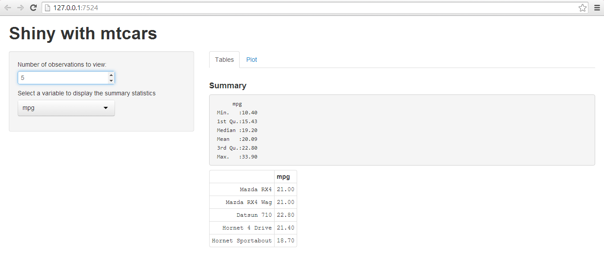
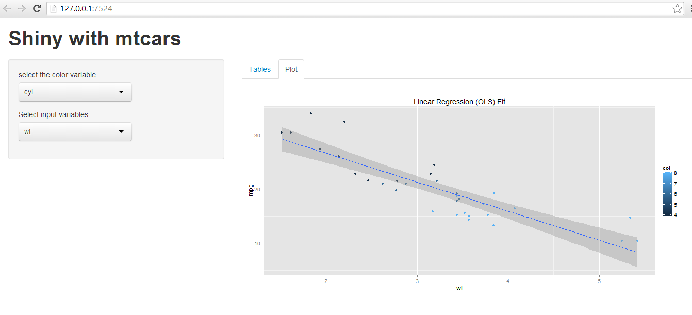

Developing Data Products Project
========================================================

Problem Statement
----------------------
* Write a shiny application with associated supporting documentation. The documentation should be thought of as whatever a user will need to get started using your application.
* Deploy the application on Rstudio's shiny server
* Share the application link by pasting it into the text box below
* Share your server.R and ui.R code on github
* The application must include the following:
  + Some form of input (widget: textbox, radio button, checkbox, ...)
  + Some operation on the ui input in sever.R
  + Some reactive output displayed as a result of server calculations
  + You must also include enough documentation so that a novice user could use 
  your application.
  + The documentation should be at the Shiny website itself. Do not post to an   
  external link.

The Shiny application in question is entirely up to you. However, if you're having trouble coming up with ideas, you could start from the simple prediction algorithm done in class and build a new algorithm on one of the R datasets packages. Please make the package simple for the end user, so that they don't need a lot of your prerequisite knowledge to evaluate your application. You should emphasize a simple project given the short time frame.  

Report
------

* A simple shiny app is created. The following 2 files are uploaded:
  + server.R
  + ui.R
 
* The application is meant to provide a simple visualization for the mtcars 
  dataset.     
  There are two tabs on the web application. 
* The first tab displays some reactive displays of the values of the variable 
  selected from the dropdown. 
  It also displays the summary of the selected variable.
  The number of data tuples displayed can be changed as well.
* The second tab displays linear regression (OLS) model fits for different 
  independent variables that can be selected from drop down list. 
  Also a 3rd variable value is shown by color coding, which can also be selected from another drop down. Accordinlgy the OLS model changes.
* The below R code snippet / the plot output in the appendix show the figures that are shown reactively.


```r
# R code
library(ggplot2)
p <- qplot(wt, mpg, data=mtcars, geom=c("point", "smooth"), 
    method="lm", formula=y~x, color=cyl, 
    main="Linear Regression (OLS) Fit", 
    xlab="wt", ylab="mpg")
p
```

 
Appendix
--------


