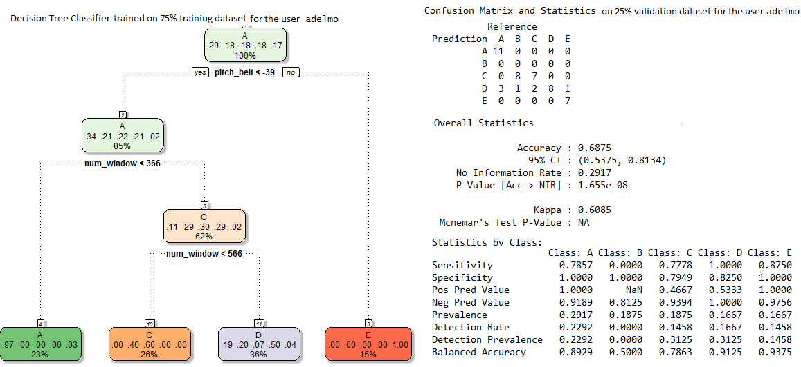
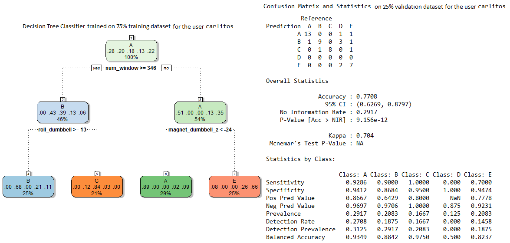
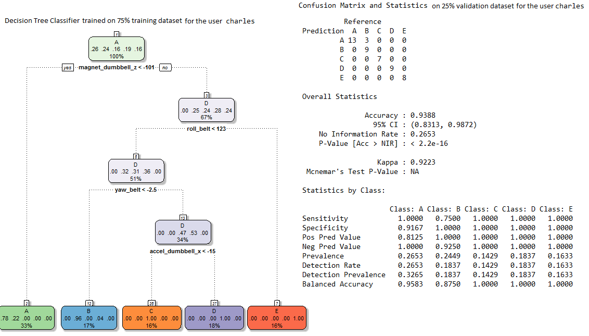
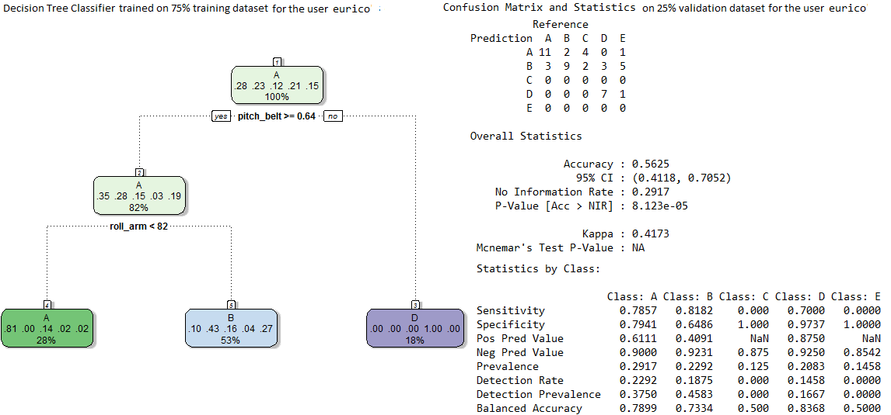
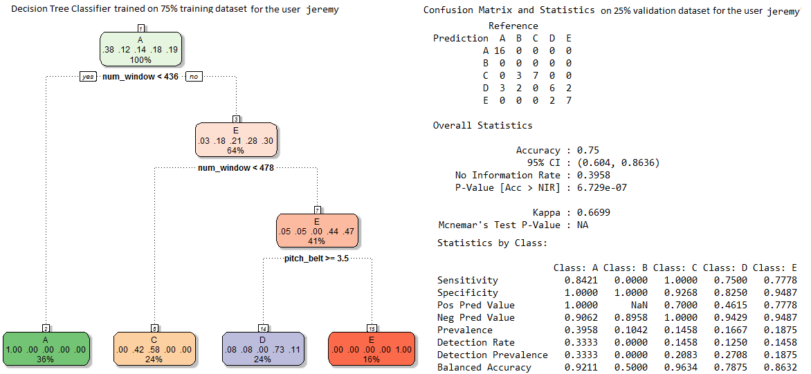
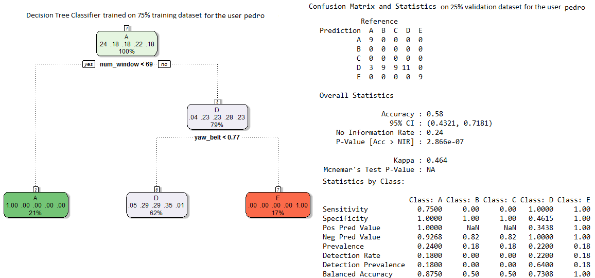
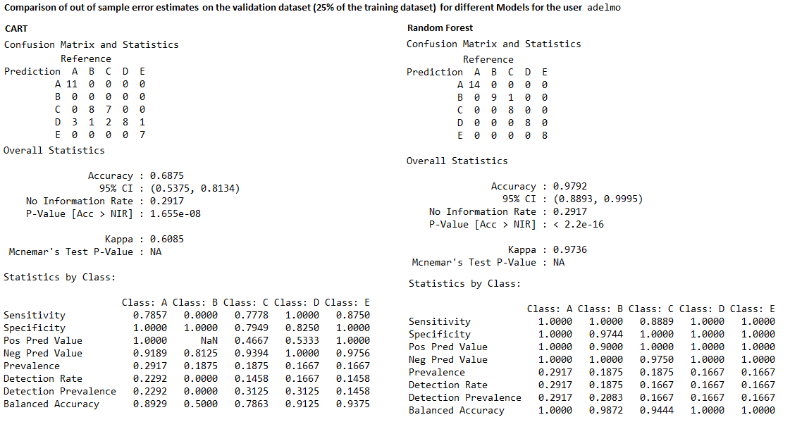
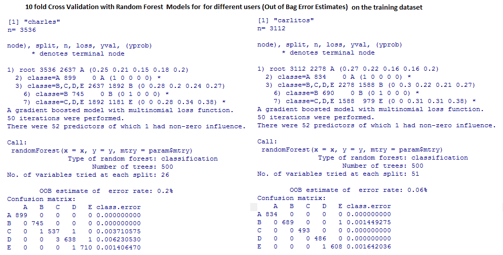

Practical Machine Learning Project
========================================================

Background
----------
Using devices such as Jawbone Up, Nike FuelBand, and Fitbit it is now possible to collect a large amount of data about personal activity relatively inexpensively. These type of devices are part of the quantified self movement - a group of enthusiasts who take measurements about themselves regularly to improve their health, to find patterns in their behavior, or because they are tech geeks. One thing that people regularly do is quantify how much of a particular activity they do, but they rarely quantify how well they do it. In this project, your goal will be to use data from accelerometers on the belt, forearm, arm, and dumbell of 6 participants. They were asked to perform barbell lifts correctly and incorrectly in 5 different ways. More information is available from the website here: http://groupware.les.inf.puc-rio.br/har (see the section on the Weight Lifting Exercise Dataset). 

Data 
----

The training data for this project are available here: https://d396qusza40orc.cloudfront.net/predmachlearn/pml-training.csv. 
The test data are available here: https://d396qusza40orc.cloudfront.net/predmachlearn/pml-testing.csv. The data for this project come from: http://groupware.les.inf.puc-rio.br/har. 

Report
------

* The training dataset contains 19622 rows and 153 columns (one of which is the output variable **classe** which is to be predicted). 
* The testing dataset contains 20 rows and 153 columns (one of which is the problem id).

* **Preprocessing**: Since the classe variable for the test tuples are needed to be predicted, a basic preprocessing is done to remove the variables only with NA / blank values in the test dataset, the variables that do not carry much information to predict classe for the testing tuples. After this step, the number of variables in the test dataset were reduced to 53. Only these variables (except problem-id) were selected from the training dataset and used as input to the classifier models to be learnt.
* The following **52** variables are used as input variables to build different classifier models and predict the output variable **classe**:

   [1] "user_name"            "new_window"           "num_window"          
   [4] "roll_belt"            "pitch_belt"           "yaw_belt"            
   [7] "total_accel_belt"     "gyros_belt_x"         "gyros_belt_y"        
  [10] "gyros_belt_z"         "accel_belt_x"         "accel_belt_y"        
  [13] "accel_belt_z"         "magnet_belt_x"        "magnet_belt_y"       
  [16] "magnet_belt_z"        "roll_arm"             "pitch_arm"           
  [19] "yaw_arm"              "total_accel_arm"      "gyros_arm_x"         
  [22] "gyros_arm_y"          "gyros_arm_z"          "accel_arm_x"         
  [25] "accel_arm_y"          "accel_arm_z"          "magnet_arm_x"        
  [28] "magnet_arm_y"         "magnet_arm_z"         "roll_dumbbell"       
  [31] "pitch_dumbbell"       "yaw_dumbbell"         "total_accel_dumbbell"
  [34] "gyros_dumbbell_x"     "gyros_dumbbell_y"     "gyros_dumbbell_z"    
  [37] "accel_dumbbell_x"     "accel_dumbbell_y"     "accel_dumbbell_z"    
  [40] "magnet_dumbbell_x"    "magnet_dumbbell_y"    "magnet_dumbbell_z"   
  [43] "total_accel_forearm"  "gyros_forearm_x"      "gyros_forearm_y"     
  [46] "gyros_forearm_z"      "accel_forearm_x"      "accel_forearm_y"     
  [49] "accel_forearm_z"      "magnet_forearm_x"     "magnet_forearm_y"    
  [52] "magnet_forearm_z"     
  
* **Per User Model**: For **each** of the 6 users, a few classifier models are trained on the corresponding subsets of the training dataset. These user-specific models are later used to predict the unseen data for the corresponding user only. (In the appendix section 6 different decision trees are shown that are learnt from the training dataset with 75-25 validation. Each tree corresponds to one user and models the manner in which the corresponding user exercises.) The following set of classifier models are used for prediction for each user:
  * CART (rpart)
  * Gradient Boosting (R gbm)
  * Random Forest
  * LDA

* The prediction of these models are combined by **stacking** them with an additional RandomForest Classifier.

* Validation: Used **caret** to divide the training dataset into 2 parts, 75% training and 25% validation dataset. Trained the models on the training dataset and predicted/validated on the validation dataset. Used **confusionMatrix** to test the accuracy on the validation dataset.

* Cross Validation: Used caret *train* function (with trControl argument) to do 10 fold cross validation for model selection.

* **Expected Out of Sample Error**: 75-25 validation dataset is used to compute out of sample error. Ensemble based techniques performs much better (e.g., for theuser *adelmo* the out of sample error with CART is 21.25% where for random Forest the same error is 2.08%, as shown in the figure in the appendix section. Also, the out of bag errors estimates with cross validation with randomForest models for different users are reported in another figure. As seen, typically randomForest OOB estimates are very low)

* **Model choices**: Most of the times Ensemble based techniques (Gradient Boosting and Random Forest) are outperforming the other techniques (CART, LDA) on the 75-25 validation dataset and also with 10 fold cross validation (in terms of accuracy and expected *out of sample error*). Hence, these two models are selected finally for test data prediction. Stacking with RandomForest is used to combine these two classifiers. The classifier set obtained for each user are then used with majority voting (to combine all the decisions) to predict the final output class for 20 different test cases.

Appendix
--------

