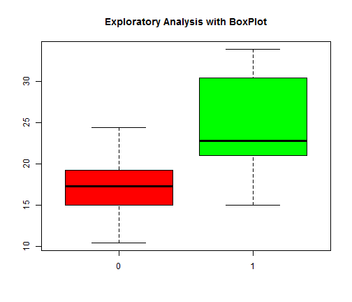
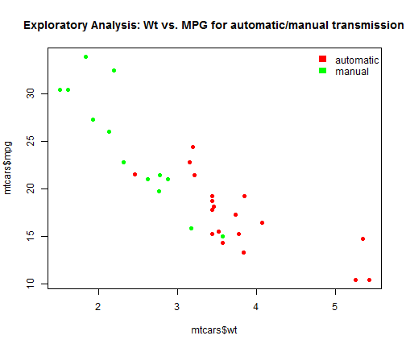
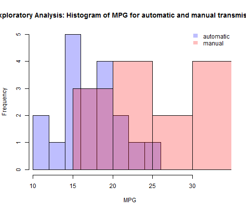
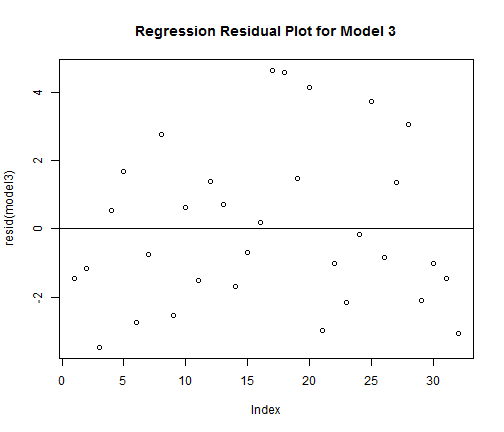
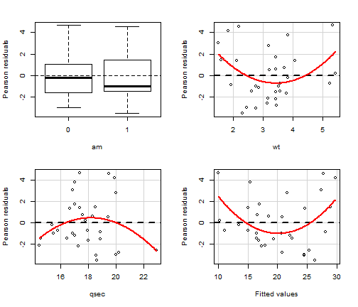
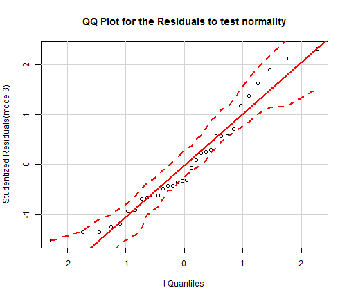
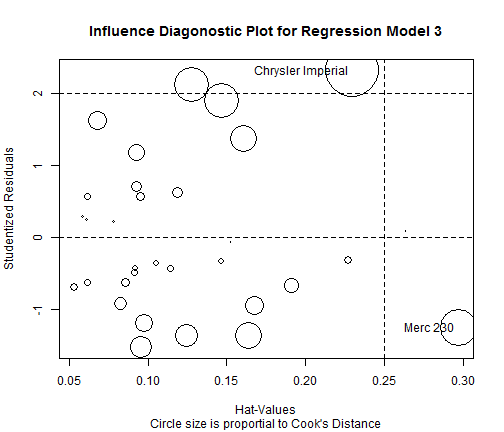

Linear Regression Project
========================================================

Problem Statement
-----------------
You work for Motor Trend, a magazine about the automobile industry. Looking at a data set of a collection of cars, they are interested in exploring the relationship between a set of variables and miles per gallon (MPG) (outcome). They are particularly interested in the following two questions:

* Is an **automatic** or **manual** transmission better for MPG?
* Quantifying how different is the MPG between **automatic** and **manual** transmissions?

Question
--------
Take the **mtcars** data set and write up an analysis to answer their question using regression models and exploratory data analyses.

Your report must be:

* Written as a PDF printout of a compiled (using knitr) R markdown document.
* Do not use any packages that are not in R-base or the library datasets.
* Brief. Roughly the equivalent of 2 pages or less for the main text. Supporting  
  figures in an appendix can be included up to 5 total pages including the 2 for      
  the main report. The appendix can only include figures.
* Include a first paragraph executive summary.
* Upload your PDF by clicking the Upload button below the text box.

Executive Summary
-----------------
The **mtcars** (Motor Trend Car Road Tests) dataset contains fuel consumption (MPG: miles/gallon) along with 10 other column variables (aspects of automobile design and performance) for 32 rows (of automobiles). The binary variable **am** stores the information whether the tramission is **automatic** (by value 0) or **manual** (by value 1) for an automobile. In order to understand which of the two transmissions is better for MPG (whether the **manual** or the **automatic** one is more likely to have higher MPG, based on the sample dataset and the assumption of the dataset being representative), first an exploratory analysis will be done, followed by an analysis with linear regression.

Exploratory Analysis
--------------------
At first from the dataset the conditional distribution of **MPG** given **automatic** and **manual** transmissions can be compared (P(MPG|am=0) and P(MPG|am=1)). Out of the 32 data tuples, there are 19 of them with automatic and 13 of them are with manual transmission. 

The R functions **tapply**, **Histogram** and **Boxplot** are used to understand the conditional distribution of MPG given transmission in the dataset. As it can be seen from the results and the plots (in the appendix), the mean MPG for manual transmission (**24.39 m/g**) is higher than that of automatic (**17.15 m/g**), which means at least in the data we have the **manual transmission better than automatic** (see appendix), precisely the MPG is **7.24 m/g** higher in case of the automobiles with manual transmission.


```r
tapply(mtcars$mpg, mtcars$am, mean)
```

```
##     0     1 
## 17.15 24.39
```

Linear Regression
-----------------
Four different linear regression models (without intercepts) are fitted to understand the impact of the independent variable **am** on the dependent variable **MPG**. 

Did the student do a residual plot and some diagnostics?
Did the student quantify the uncertainty in their conclusions and/or perform an inference correctly?

* At first, the **am** variable is converted to a factor variable.
* The first OLS linear regression model is fitted with **am** as the only independent variable and **MPG** as the dependent variable. As can be seen, both the variables **am0** and **am1** are **highly significant**.
* **Coefficient Interpretation**: It shows that the unadjusted effect of the tranmission (**am**) variable on MPG: automatic transmission (**am0**) increases **MPG** by 17.15 m/g, while manual transmission (**am1**) increases **MPG**
by 24.39 m/g - same result as was obtained from the exploratory analysis boxplots.
* **Strategy for model selection**: Model \(R^2\) and **adjusted** \(R^2\) are used as performance measures for model selection. **Nested model testing** (with **Anova**) is done to test if the additional regressors are significant.
* For the first model, both \(R^2\) and adjusted \(R^2\) are pretty high (94.9% and 94.5% respectively), which indicates that the model captures a high proportion of the variance in MPG and without overfitting.
* The second model was created with taking one more independent variable **wt** as  regressor and MPG as the dependent variable. As can be seen, all the variables are significant. It also shows that keeping the variable **wt** fixed, automatic transmission (**am0**) increases **MPG** by 37.322 m/g, while manual transmission (**am1**) increases **MPG** by 37.298 m/g. \(R^2\) and **adjusted** \(R^2\) for the second model are 98% and 97.8% respectively, which has increased from the first model. 
* The third model was created with one more regressor **qsec**. Now, all but the variable **am0** (automatic transmission) are significant. It also shows that keeping all other independent variables fixed, automatic transmission (**am0**) increases **MPG** by 9.618, while manual transmission (**am1**) increases **MPG** by 12.554.\(R^2\) and **adjusted** \(R^2\) are 98.8% and 98.6% resp., which has again increased from the second model.
* Finally, the fourth model was created with all 10 independent variables and MPG as the dependent variable. As can be seen, the only variable that is significant at 5% level is wt. It also shows that keeping all other independent variables fixed, automatic transmission (**am0**) increases **MPG** by 12.3034, while manual transmission (**am1**) increases **MPG** by 14.8236.\(R^2\) and **adjusted** \(R^2\) are 98.9% and 98.4% resp., the **adjusted** \(R^2\) has decreased from the third model, which means addition of the additional regressors does not add to the  explainatory power of the model.
* Anova test also confirms that adding more regressors to model 3 does not improve the explainatory power of the model. Hence, the model 3 can be used for **quantifying how different is the MPG between automatic and manual transmissions** (with adjusted effects of the trasmission variable). As can be seen, as per this model, the estimated MPG for an automobile with automatic transmission is **2.936 m/ higher** than that of the manual transmission, keeping the other variables fixed.
* **Residual plots** (see appendix) for the selected final model (model 3) shows presence of some weak pattern (significant p values for **wt** residual) although **qqplot** (see appendix) shows that it's approximately normal and passes the heteroskedasticity hypothesis test. Also, the **influence plot** shows the data points with high Cooks Distance and hat matrix show the leverage points with high hatvalues. 
* **Conclusion**: The sample dataset is pretty small in size and if it's not representative enough, the conclusion that the manual transmission is better than automatic transmission may not generalize to the entire population (may **overfit**).


```r
#cor(mtcars)
mtcars$am <- as.factor(mtcars$am)
model1 <- lm(mpg~am-1, data=mtcars)
summary(model1) # model 1
```

```
## 
## Call:
## lm(formula = mpg ~ am - 1, data = mtcars)
## 
## Residuals:
##    Min     1Q Median     3Q    Max 
## -9.392 -3.092 -0.297  3.244  9.508 
## 
## Coefficients:
##     Estimate Std. Error t value Pr(>|t|)    
## am0    17.15       1.12    15.2  1.1e-15 ***
## am1    24.39       1.36    17.9  < 2e-16 ***
## ---
## Signif. codes:  0 '***' 0.001 '**' 0.01 '*' 0.05 '.' 0.1 ' ' 1
## 
## Residual standard error: 4.9 on 30 degrees of freedom
## Multiple R-squared:  0.949,	Adjusted R-squared:  0.945 
## F-statistic:  277 on 2 and 30 DF,  p-value: <2e-16
```

```r
model2 <- update(model1, mpg~am+wt-1) # model 2
summary(model2)
```

```
## 
## Call:
## lm(formula = mpg ~ am + wt - 1, data = mtcars)
## 
## Residuals:
##    Min     1Q Median     3Q    Max 
## -4.530 -2.362 -0.132  1.403  6.878 
## 
## Coefficients:
##     Estimate Std. Error t value Pr(>|t|)    
## am0   37.322      3.055   12.22  5.8e-13 ***
## am1   37.298      2.086   17.88  < 2e-16 ***
## wt    -5.353      0.788   -6.79  1.9e-07 ***
## ---
## Signif. codes:  0 '***' 0.001 '**' 0.01 '*' 0.05 '.' 0.1 ' ' 1
## 
## Residual standard error: 3.1 on 29 degrees of freedom
## Multiple R-squared:  0.98,	Adjusted R-squared:  0.978 
## F-statistic:  478 on 3 and 29 DF,  p-value: <2e-16
```

```r
model3 <- update(model2, mpg~am+wt+qsec-1) # model 3
summary(model3)
```

```
## 
## Call:
## lm(formula = mpg ~ am + wt + qsec - 1, data = mtcars)
## 
## Residuals:
##    Min     1Q Median     3Q    Max 
## -3.481 -1.556 -0.726  1.411  4.661 
## 
## Coefficients:
##      Estimate Std. Error t value Pr(>|t|)    
## am0     9.618      6.960    1.38  0.17792    
## am1    12.554      6.057    2.07  0.04754 *  
## wt     -3.917      0.711   -5.51    7e-06 ***
## qsec    1.226      0.289    4.25  0.00022 ***
## ---
## Signif. codes:  0 '***' 0.001 '**' 0.01 '*' 0.05 '.' 0.1 ' ' 1
## 
## Residual standard error: 2.46 on 28 degrees of freedom
## Multiple R-squared:  0.988,	Adjusted R-squared:  0.986 
## F-statistic:  574 on 4 and 28 DF,  p-value: <2e-16
```

```r
model4 <- update(model3, mpg~am+wt+qsec+cyl+disp+hp+drat+vs+gear+carb-1) # model 4
summary(model4)
```

```
## 
## Call:
## lm(formula = mpg ~ am + wt + qsec + cyl + disp + hp + drat + 
##     vs + gear + carb - 1, data = mtcars)
## 
## Residuals:
##    Min     1Q Median     3Q    Max 
##  -3.45  -1.60  -0.12   1.22   4.63 
## 
## Coefficients:
##      Estimate Std. Error t value Pr(>|t|)  
## am0   12.3034    18.7179    0.66    0.518  
## am1   14.8236    18.3527    0.81    0.428  
## wt    -3.7153     1.8944   -1.96    0.063 .
## qsec   0.8210     0.7308    1.12    0.274  
## cyl   -0.1114     1.0450   -0.11    0.916  
## disp   0.0133     0.0179    0.75    0.463  
## hp    -0.0215     0.0218   -0.99    0.335  
## drat   0.7871     1.6354    0.48    0.635  
## vs     0.3178     2.1045    0.15    0.881  
## gear   0.6554     1.4933    0.44    0.665  
## carb  -0.1994     0.8288   -0.24    0.812  
## ---
## Signif. codes:  0 '***' 0.001 '**' 0.01 '*' 0.05 '.' 0.1 ' ' 1
## 
## Residual standard error: 2.65 on 21 degrees of freedom
## Multiple R-squared:  0.989,	Adjusted R-squared:  0.984 
## F-statistic:  180 on 11 and 21 DF,  p-value: <2e-16
```

```r
anova(model1, model2, model3, model4)
```

```
## Analysis of Variance Table
## 
## Model 1: mpg ~ am - 1
## Model 2: mpg ~ am + wt - 1
## Model 3: mpg ~ am + wt + qsec - 1
## Model 4: mpg ~ am + wt + qsec + cyl + disp + hp + drat + vs + gear + carb - 
##     1
##   Res.Df RSS Df Sum of Sq     F  Pr(>F)    
## 1     30 721                               
## 2     29 278  1       443 63.01 9.3e-08 ***
## 3     28 169  1       109 15.52 0.00075 ***
## 4     21 147  7        22  0.44 0.86361    
## ---
## Signif. codes:  0 '***' 0.001 '**' 0.01 '*' 0.05 '.' 0.1 ' ' 1
```

```r
library(car)
ncvTest(model3)
```

```
## Non-constant Variance Score Test 
## Variance formula: ~ fitted.values 
## Chisquare = 1.558    Df = 1     p = 0.2119
```

```r
hatvalues(model3)
```

```
##           Mazda RX4       Mazda RX4 Wag          Datsun 710 
##             0.08567             0.09143             0.09548 
##      Hornet 4 Drive   Hornet Sportabout             Valiant 
##             0.07759             0.09268             0.09747 
##          Duster 360           Merc 240D            Merc 230 
##             0.14667             0.09219             0.29704 
##            Merc 280           Merc 280C          Merc 450SE 
##             0.06063             0.06115             0.06105 
##          Merc 450SL         Merc 450SLC  Cadillac Fleetwood 
##             0.05818             0.05304             0.22701 
## Lincoln Continental   Chrysler Imperial            Fiat 128 
##             0.26422             0.22963             0.12763 
##         Honda Civic      Toyota Corolla       Toyota Corona 
##             0.11866             0.14635             0.16393 
##    Dodge Challenger         AMC Javelin          Camaro Z28 
##             0.09214             0.08223             0.15268 
##    Pontiac Firebird           Fiat X1-9       Porsche 914-2 
##             0.06803             0.10489             0.09485 
##        Lotus Europa      Ford Pantera L        Ferrari Dino 
##             0.16065             0.16775             0.11382 
##       Maserati Bora          Volvo 142E 
##             0.19098             0.12428
```

Appendix
--------


```r
boxplot(mpg~am, data=mtcars, col=c("red", "green"), main="Exploratory Analysis with BoxPlot")
```

 

```r
plot(mtcars$wt, mtcars$mpg, col = ifelse(mtcars$am == 0,'red','green'), pch = 19, main = "Exploratory Analysis: Wt vs. MPG for automatic/manual transmission")
legend('topright',c('automatic','manual'),
       fill = c("red", "green"), bty = 'n', border = NA)
```

 

```r
#plot(mtcars$am, mtcars$mpg, col = ifelse(mtcars$am == 0,'red','green'), pch = 19)
mpg.auto <- mtcars[mtcars$am == 0,]$mpg
mpg.man <- mtcars[mtcars$am == 1,]$mpg
hist(mpg.auto, col=rgb(0,0,1,1/4), xlim=c(min(mtcars$mpg),max(mtcars$mpg)), xlab="MPG", main="Exploratory Analysis: Histogram of MPG for automatic and manual transmissions")
hist(mpg.man, col=rgb(1,0,0,1/4), xlim=c(min(mtcars$mpg),max(mtcars$mpg)), add=T)
legend('topright',c('automatic','manual'),
       fill = c(rgb(0,0,1,1/4), rgb(1,0,0,1/4)), bty = 'n',
       border = NA)
```

 

```r
plot(resid(model3), main="Regression Residual Plot for Model 3")
abline(0, 0)
```

 

```r
library(car)
residualPlots(model3)
```

 

```
##            Test stat Pr(>|t|)
## am                NA       NA
## wt             2.816    0.009
## qsec          -1.565    0.129
## Tukey test     3.227    0.001
```

```r
qqPlot(model3, main="QQ Plot for the Residuals to test normality")
```

 

```r
influencePlot(model3, main="Influence Diagonostic Plot for Regression Model 3", sub="Circle size is proportial to Cook's Distance")
```

 

```
##                   StudRes    Hat  CookD
## Merc 230           -1.251 0.2970 0.4026
## Chrysler Imperial   2.323 0.2296 0.5896
```

