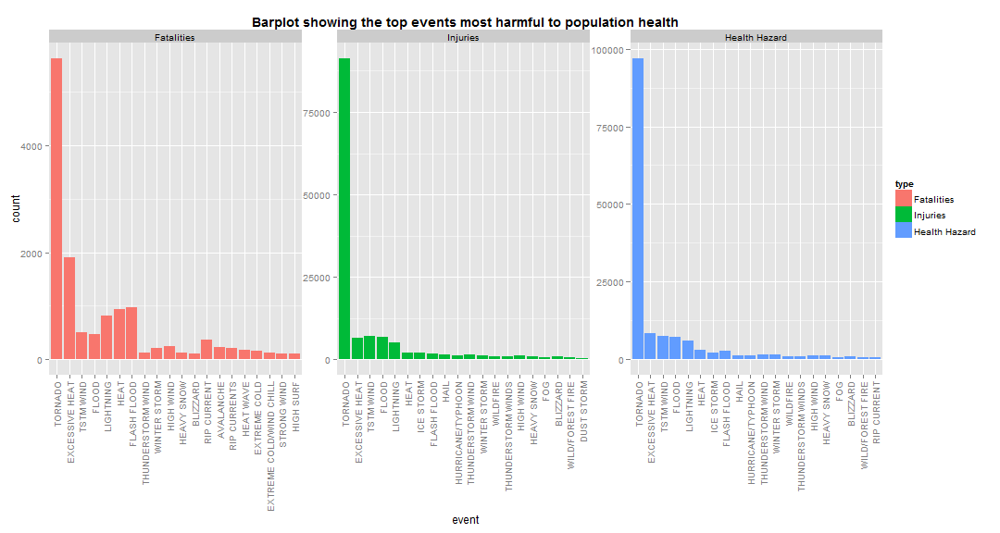
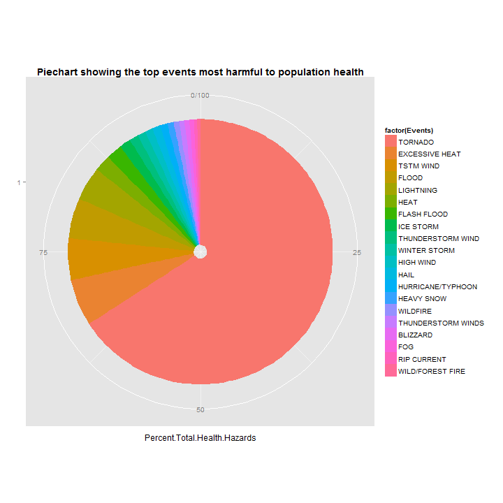
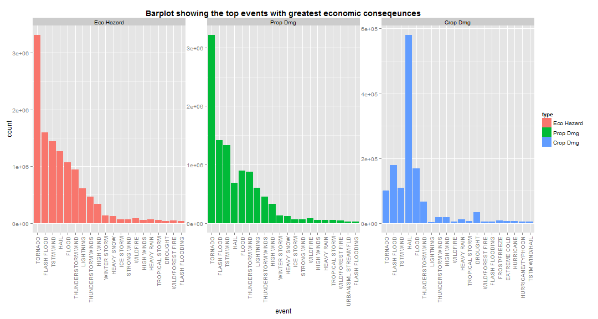

Analyzing the impacts of Severe Weather Events  on Health and Economy from the NOAA dataset
=================================================================================

Synopsys
--------

The basic goal of this analysis is to explore the **NOAA Storm Database** and answer some basic questions about severe weather events. 

The data analysis will address the following two questions:

* "Across the United States, which types of events (as indicated in the 
 **EVTYPE** variable) are most harmful with respect to population health".
In order to answer this question couple of variables in the dataset will be used to measure the impact of a severe weather event on population health, namely, **INJURIES** and **FATALITIES**. Also, a new derived variable **Health_Hazards** will be created by adding these variables to measure the total impact.

* "Across the United States, which types of events have the greatest economic
consequences". In order to answer this question, again another couple of variables in the dataset will be used to measure the impact of a severe weather event on economy, namely, **PROPDMG** and **CROPDMG**. Also, a new derived variable **Eco_Hazards** will be created by adding these variables to measure the total impact.

The exploratory data analysis will be done using R and **barplots** will be used to compare the impact of a severe event, both on population health and economy. Two sepearate analysis will be done to answer to two different questions.

As will be seen, **TORNADO** has the highest impact in terms of harmfulness in both the cases.

### Data Processing


```r
storm <- read.csv(bzfile("repdata-data-StormData.csv.bz2"))
names(storm)
```

```
##  [1] "STATE__"    "BGN_DATE"   "BGN_TIME"   "TIME_ZONE"  "COUNTY"    
##  [6] "COUNTYNAME" "STATE"      "EVTYPE"     "BGN_RANGE"  "BGN_AZI"   
## [11] "BGN_LOCATI" "END_DATE"   "END_TIME"   "COUNTY_END" "COUNTYENDN"
## [16] "END_RANGE"  "END_AZI"    "END_LOCATI" "LENGTH"     "WIDTH"     
## [21] "F"          "MAG"        "FATALITIES" "INJURIES"   "PROPDMG"   
## [26] "PROPDMGEXP" "CROPDMG"    "CROPDMGEXP" "WFO"        "STATEOFFIC"
## [31] "ZONENAMES"  "LATITUDE"   "LONGITUDE"  "LATITUDE_E" "LONGITUDE_"
## [36] "REMARKS"    "REFNUM"
```

```r
head(storm)
```

```
##   STATE__           BGN_DATE BGN_TIME TIME_ZONE COUNTY COUNTYNAME STATE
## 1       1  4/18/1950 0:00:00     0130       CST     97     MOBILE    AL
## 2       1  4/18/1950 0:00:00     0145       CST      3    BALDWIN    AL
## 3       1  2/20/1951 0:00:00     1600       CST     57    FAYETTE    AL
## 4       1   6/8/1951 0:00:00     0900       CST     89    MADISON    AL
## 5       1 11/15/1951 0:00:00     1500       CST     43    CULLMAN    AL
## 6       1 11/15/1951 0:00:00     2000       CST     77 LAUDERDALE    AL
##    EVTYPE BGN_RANGE BGN_AZI BGN_LOCATI END_DATE END_TIME COUNTY_END
## 1 TORNADO         0                                               0
## 2 TORNADO         0                                               0
## 3 TORNADO         0                                               0
## 4 TORNADO         0                                               0
## 5 TORNADO         0                                               0
## 6 TORNADO         0                                               0
##   COUNTYENDN END_RANGE END_AZI END_LOCATI LENGTH WIDTH F MAG FATALITIES
## 1         NA         0                      14.0   100 3   0          0
## 2         NA         0                       2.0   150 2   0          0
## 3         NA         0                       0.1   123 2   0          0
## 4         NA         0                       0.0   100 2   0          0
## 5         NA         0                       0.0   150 2   0          0
## 6         NA         0                       1.5   177 2   0          0
##   INJURIES PROPDMG PROPDMGEXP CROPDMG CROPDMGEXP WFO STATEOFFIC ZONENAMES
## 1       15    25.0          K       0                                    
## 2        0     2.5          K       0                                    
## 3        2    25.0          K       0                                    
## 4        2     2.5          K       0                                    
## 5        2     2.5          K       0                                    
## 6        6     2.5          K       0                                    
##   LATITUDE LONGITUDE LATITUDE_E LONGITUDE_ REMARKS REFNUM
## 1     3040      8812       3051       8806              1
## 2     3042      8755          0          0              2
## 3     3340      8742          0          0              3
## 4     3458      8626          0          0              4
## 5     3412      8642          0          0              5
## 6     3450      8748          0          0              6
```

```r
dim(storm)
```

```
## [1] 902297     37
```

```r
loc_vars <- c("STATE", "BGN_DATE", "EVTYPE")
health_vars <- c("FATALITIES", "INJURIES")
prop_vars <- c("PROPDMG", "CROPDMG")
```
* As can be seen from above, only the *health_vars* and the *population_vars* are the two sets of variables that will be used to answer question 1 and 2 respectively. The variables from the set *loc_vars*, although never used in current analysis, could be used to analyze location-specific impacts.

### Q1: Across the United States, which types of events (as indicated in the **EVTYPE** variable) are most harmful with respect to population health?

* In order to answer this question, couple of variables in the dataset will be used to measure the impact of a severe weather event on population health, 
namely, **INJURIES** and **FATALITIES**. 
* A new derived variable **Health_Hazards** is created by adding these two variables (**Health_Hazards = INJURIES + FATALITIES**) to measure the total impact.

### Results of Analysis


```r
storm1 <- storm[c(loc_vars, health_vars)]
storm1$Health_Hazards <- storm1$FATALITIES + storm1$INJURIES
fatalities <- sort(tapply(storm1$FATALITIES, storm1$EVTYPE, sum), decreasing=TRUE)
injuries <- sort(tapply(storm1$INJURIES, storm1$EVTYPE, sum), decreasing=TRUE)
hazards <- sort(tapply(storm1$Health_Hazards, storm1$EVTYPE, sum), decreasing=TRUE)
n <- 20 # top 20 harmful events
fatalities <- head(fatalities, n) #f[f > 0]
injuries <- head(injuries, n) #i[i > 0]
hazards <- head(hazards, n) #h[h > 0]
fatalities <- as.data.frame(cbind(event=names(fatalities), count=fatalities, type="Fatalities"))
injuries <- as.data.frame(cbind(event=names(injuries), count=injuries, type="Injuries"))
hazards <- as.data.frame(cbind(event=names(hazards), count=hazards, type="Health Hazard"))
d <- rbind(fatalities, injuries, hazards)
d$count <- as.integer(as.character(d$count))
d <- transform(d, event = reorder(event, -count))
hazards$count <- as.integer(as.character(hazards$count))
tblHealth <- cbind(fatalities[1:2], injuries[1:2])
names(tblHealth) <- c("Events", "Fatalities", "Events", "Injuries")
print(tblHealth, row.names=FALSE)
```

```
##                   Events Fatalities             Events Injuries
##                  TORNADO       5633            TORNADO    91346
##           EXCESSIVE HEAT       1903          TSTM WIND     6957
##              FLASH FLOOD        978              FLOOD     6789
##                     HEAT        937     EXCESSIVE HEAT     6525
##                LIGHTNING        816          LIGHTNING     5230
##                TSTM WIND        504               HEAT     2100
##                    FLOOD        470          ICE STORM     1975
##              RIP CURRENT        368        FLASH FLOOD     1777
##                HIGH WIND        248  THUNDERSTORM WIND     1488
##                AVALANCHE        224               HAIL     1361
##             WINTER STORM        206       WINTER STORM     1321
##             RIP CURRENTS        204  HURRICANE/TYPHOON     1275
##                HEAT WAVE        172          HIGH WIND     1137
##             EXTREME COLD        160         HEAVY SNOW     1021
##        THUNDERSTORM WIND        133           WILDFIRE      911
##               HEAVY SNOW        127 THUNDERSTORM WINDS      908
##  EXTREME COLD/WIND CHILL        125           BLIZZARD      805
##              STRONG WIND        103                FOG      734
##                 BLIZZARD        101   WILD/FOREST FIRE      545
##                HIGH SURF        101         DUST STORM      440
```

```r
tblHealth <- cbind(hazards[1:2], round(100*hazards[2] / sum(hazards[2]),2))
names(tblHealth) <- c("Events", "Total.Health.Hazards", "Percent.Total.Health.Hazards")
print(tblHealth, row.names=FALSE)
```

```
##              Events Total.Health.Hazards Percent.Total.Health.Hazards
##             TORNADO                96979                        65.86
##      EXCESSIVE HEAT                 8428                         5.72
##           TSTM WIND                 7461                         5.07
##               FLOOD                 7259                         4.93
##           LIGHTNING                 6046                         4.11
##                HEAT                 3037                         2.06
##         FLASH FLOOD                 2755                         1.87
##           ICE STORM                 2064                         1.40
##   THUNDERSTORM WIND                 1621                         1.10
##        WINTER STORM                 1527                         1.04
##           HIGH WIND                 1385                         0.94
##                HAIL                 1376                         0.93
##   HURRICANE/TYPHOON                 1339                         0.91
##          HEAVY SNOW                 1148                         0.78
##            WILDFIRE                  986                         0.67
##  THUNDERSTORM WINDS                  972                         0.66
##            BLIZZARD                  906                         0.62
##                 FOG                  796                         0.54
##         RIP CURRENT                  600                         0.41
##    WILD/FOREST FIRE                  557                         0.38
```

* As can be seen from above, **TORNADO, EXCESSIVE HEAT, TSTM WIND, FLOOD, LIGHTNING** are the top events that are most harmful to population health, causing 65.86%, 5.72%, 5.07%, 4.93%, 4.11% and 2.06% of health hazards resepectively. The barplot and the pie charts below pictorially show the same result.


```r
library(ggplot2)
ggplot(d, aes(x=event, y=count, fill=type)) + 
geom_bar(stat="identity") +
facet_wrap(~type, scales = "free") + 
ggtitle("Barplot showing the top events most harmful to population health") + 
theme(axis.text.x=element_text(angle=90,hjust=1,vjust=0.5),
      plot.title = element_text(lineheight=.8, face="bold"))  
```

 


```r
tblHealth <- transform(tblHealth, Events = reorder(Events, -Percent.Total.Health.Hazards))
p <- ggplot(data=tblHealth, 
       aes(x=factor(1),
           y=Percent.Total.Health.Hazards,
           fill = factor(Events))
       )
p <- p + geom_bar(stat = "identity") + xlab("")
p + coord_polar(theta="y") + 
    ggtitle("Piechart showing the top events most harmful to population health") + 
    theme(plot.title = element_text(lineheight=.8, face="bold"))  
```

 


### Q2: Across the United States, which types of events have the greatest economic
consequences? 

* In order to answer this question, again another couple of variables in the dataset are used to measure the impact of a severe weather event on economy, namely, 
**PROPDMG** and **CROPDMG**. 

* Also, a new derived variable **Eco_Hazards** is created by adding these variables (**Eco_Hazards = PROPDMG + CROPDMG**) to measure the total impact.

### Results of Analysis


```r
storm2 <- storm[c(loc_vars, prop_vars)]
storm2$PROPDMG <- as.numeric(as.character(storm2$PROPDMG))
storm2$CROPDMG <- as.numeric(as.character(storm2$CROPDMG))
storm2$Eco_Hazards <- storm2$PROPDMG + storm2$CROPDMG
hazards <- sort(tapply(storm2$Eco_Hazards, storm2$EVTYPE, sum), decreasing=TRUE)
prop <- sort(tapply(storm2$PROPDMG, storm2$EVTYPE, sum), decreasing=TRUE)
crop <- sort(tapply(storm2$CROPDMG, storm2$EVTYPE, sum), decreasing=TRUE)
n <- 20 # top 20 harmful
prop <- head(prop, n)
crop <- head(crop, n)
hazards <- head(hazards, n)
hazards <- as.data.frame(cbind(event=names(hazards), count=hazards, type="Eco Hazard"))
prop <- as.data.frame(cbind(event=names(prop), count=prop, type="Prop Dmg"))
crop <- as.data.frame(cbind(event=names(crop), count=crop, type="Crop Dmg"))
d <- rbind(hazards, prop, crop)
d$count <- as.numeric(as.character(d$count))
d <- transform(d, event = reorder(event, -count))
hazards$count <- as.numeric(as.character(hazards$count))
tblHealth <- cbind(prop[1:2], crop[1:2])
names(tblHealth) <- c("Events", "PropDmg", "Events", "CropDmg")
print(tblHealth, row.names=FALSE)
```

```
##                Events    PropDmg             Events   CropDmg
##               TORNADO 3212258.16               HAIL 579596.28
##           FLASH FLOOD 1420124.59        FLASH FLOOD 179200.46
##             TSTM WIND 1335965.61              FLOOD 168037.88
##                 FLOOD  899938.48          TSTM WIND  109202.6
##     THUNDERSTORM WIND  876844.17            TORNADO 100018.52
##                  HAIL  688693.38  THUNDERSTORM WIND  66791.45
##             LIGHTNING  603351.78            DROUGHT  33898.62
##    THUNDERSTORM WINDS  446293.18 THUNDERSTORM WINDS  18684.93
##             HIGH WIND  324731.56          HIGH WIND  17283.21
##          WINTER STORM  132720.59         HEAVY RAIN   11122.8
##            HEAVY SNOW  122251.99       FROST/FREEZE   7034.14
##              WILDFIRE   84459.34       EXTREME COLD   6121.14
##             ICE STORM   66000.67     TROPICAL STORM   5899.12
##           STRONG WIND   62993.81          HURRICANE   5339.31
##            HIGH WINDS      55625     FLASH FLOODING   5126.05
##            HEAVY RAIN   50842.14  HURRICANE/TYPHOON   4798.48
##        TROPICAL STORM   48423.68           WILDFIRE    4364.2
##      WILD/FOREST FIRE   39344.95     TSTM WIND/HAIL   4356.65
##        FLASH FLOODING   28497.15   WILD/FOREST FIRE   4189.54
##  URBAN/SML STREAM FLD   26051.94          LIGHTNING   3580.61
```

```r
tblHealth <- cbind(hazards[1:2], round(100*hazards[2] / sum(hazards[2]),2))
names(tblHealth) <- c("Events", "Total.Eco.Hazards", "Percent.Total.Eco.Hazards")
print(tblHealth, row.names=FALSE)
```

```
##              Events Total.Eco.Hazards Percent.Total.Eco.Hazards
##             TORNADO           3312277                     28.02
##         FLASH FLOOD           1599325                     13.53
##           TSTM WIND           1445168                     12.23
##                HAIL           1268290                     10.73
##               FLOOD           1067976                      9.04
##   THUNDERSTORM WIND            943636                      7.98
##           LIGHTNING            606932                      5.13
##  THUNDERSTORM WINDS            464978                      3.93
##           HIGH WIND            342015                      2.89
##        WINTER STORM            134700                      1.14
##          HEAVY SNOW            124418                      1.05
##            WILDFIRE             88824                      0.75
##           ICE STORM             67690                      0.57
##         STRONG WIND             64611                      0.55
##          HEAVY RAIN             61965                      0.52
##          HIGH WINDS             57385                      0.49
##      TROPICAL STORM             54323                      0.46
##    WILD/FOREST FIRE             43534                      0.37
##             DROUGHT             37998                      0.32
##      FLASH FLOODING             33623                      0.28
```
* As can be seen from above, **TORNADO, FLASH FLOOD, TSTM WIND, HAIL, FLOOD, THUNDERSTORM WIND** are the top events that have greatest economic consequences, causing 28.02%, 13.53%, 12.23%, 10.73%, 9.04% and 7.98% of economic hazards resepectively. The barplot below pictorially shows the same result.


```r
ggplot(d, aes(x=event, y=count, fill=type)) + 
geom_bar(stat="identity") + facet_wrap(~type, scales = "free") + 
ggtitle("Barplot showing the top events with greatest economic conseqeunces") + 
theme(axis.text.x=element_text(angle=90,hjust=1,vjust=0.5),
      plot.title = element_text(lineheight=.8, face="bold"))  
```

 

### Data Transformation

* As can be seen from the above analysis, the only data transformation used was to convert the absolute values of the health / economic hazards to corresponding percentage values, since proportions (relative to all the hazards) give better insights.
