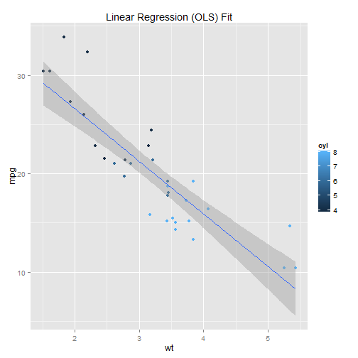

* The application is meant to provide a simple visualization for the mtcars dataset. The published version of the pitch can be found at *
  *http://sandipan.github.io/*.
* This Motor Trend Car Road Tests dataset comes along with the R base packages. It comprises of the fuel consumption and 10 aspects of automobile design / 
  performance.
* There are two tabs on the web application, one for displaying the data and the basic statistics in tabular view, another for plotting the models fit. 
* The first tab displays some reactive displays of the values of the variable selected from the dropdown. It also displays the summary of the selected variable.
* The number of data tuples displayed can be changed as well.
* The second tab displays linear regression (OLS) model fits for different independent variables 9can be selected from drop down list). Also a 3rd variable   
  value is shown by color coding, which can also be selected from another drop down. Accordingly the OLS model changes.
* The R code snippet on the next slide show the figures that are shown reactively.

--- 

* The first tab provides some basic **exploratory analysis** on a variable, while
  the second tab visualizes a **predictive modeling** (in terms of OLS fitting) to model the variable
  mpg (miles per gallon) as a linear function of the input variable chosen from the drop down.

* If one selects the "mpg" variable on the first tab, the summary and the values for the 
  the variable will be shown in a tabular format as shown below, although the implementation
  will be reactive w.r.t. the variable selected. 


```r
summary(mtcars$mpg)
```

```
##    Min. 1st Qu.  Median    Mean 3rd Qu.    Max. 
##    10.4    15.4    19.2    20.1    22.8    33.9
```

---

* If on second tab, one selects the "wt" as the independent variable ans "cyl" as color, the following model will be fit
```r
library(ggplot2)
qplot(wt, mpg, data=mtcars, geom=c("point", "smooth"), 
method="lm", formula=y~x, color=cyl, 
main="Linear Regression (OLS) Fit", 
xlab="wt", ylab="mpg")
```
 

--- 

* On the other hand, in the second tab, if one selects "qsec" as the independent variable ans "cyl" as color, the following model will be fit.
```r
library(ggplot2)
qplot(qsec, mpg, data=mtcars, geom=c("point", "smooth"), 
method="lm", formula=y~x, color=cyl, 
main="Linear Regression (OLS) Fit", 
xlab="qsec", ylab="mpg")
```
 
